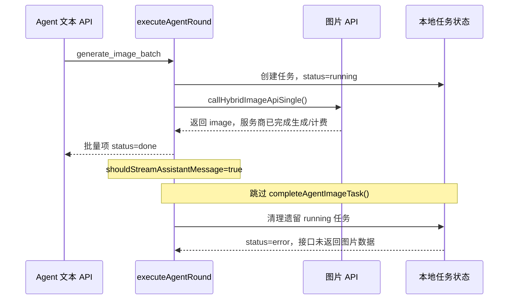

# Agent 混合模式批量生图“已扣费但显示失败”修复方案

## 1. 文档目的

本文档描述 Agent 混合模式批量生图中“图片接口实际成功并产生费用，但任务卡片显示生成失败”的根因、影响范围、最小修复方式、回归测试、验收标准和发布检查。

本文档只给出修复设计，不包含业务代码修改。

## 2. 问题摘要

问题不是服务商未生成图片，也不是返回数据格式无法解析，而是应用已经取得成功的图片结果后，没有把结果提交到任务状态中。

受影响请求同时满足以下条件：

1. Agent API 配置模式为 `hybrid`。
2. Agent 使用 `generate_image_batch` 批量生成图片。
3. Agent 文本 API 配置的 `streamImages` 为 `true`。
4. 图片接口成功返回至少一张图片。

OpenAI 配置默认启用 `streamImages`，所以默认配置很容易触发该问题。

典型表现：

- 图片服务商侧请求成功并计费。
- Agent 的批量函数结果可能把该图片统计为 `done`。
- 对应本地任务仍保持 `running`。
- 后续兜底清理把任务改成 `error`，错误为“接口未返回图片数据”。
- 图片结果没有写入图片存储，任务卡片最终显示“生成失败”。

## 3. 影响范围

### 3.1 受影响

- Agent 混合模式。
- `generate_image_batch` 批量函数调用。
- Agent 文本 API 开启流式传输。
- OpenAI、fal.ai 或自定义图片服务商均可能受影响，因为错误发生在统一的混合模式批量结果处理层。
- 一次批量中的成功图片可能全部被错误标记为失败。

### 3.2 不受影响或不是同一根因

- Agent 混合模式的单图 `generate_image` 路径：该路径收到 `result.image` 后会无条件调用 `completeAgentImageTask()`。
- Agent 原生模式的内置 `image_generation`：其流式完成回调会提交图片任务。
- 普通图库模式：不经过本问题对应的 Agent 批量状态分支。
- 服务商明确返回 HTTP 错误、安全拒绝、空结果或不可识别响应：这些是真实失败，应继续保留错误状态。
- 网络中断或客户端超时后服务端仍继续生成：这属于另一类“已计费但客户端未取得最终结果”问题，不应与本缺陷混为一谈。

## 4. 根因分析

### 4.1 两套配置被错误地混用

Agent 混合模式存在两套 API 配置：

- `activeProfile`：Agent 文本/规划请求使用的配置。
- `imageProfile`：实际图片生成请求使用的配置。

`shouldStreamAssistantMessage` 由 `activeProfile.streamImages` 决定：

```ts
const shouldStreamAssistantMessage = activeProfile.streamImages === true
```

这个变量描述的是 Agent 文本响应是否流式，不应该决定独立图片请求的成功结果是否需要写入任务。

### 4.2 混合模式批量分支取得图片但没有提交任务

混合模式批量请求通过 `callHybridImageApiSingle()` 调用统一图片 API。该函数返回：

```ts
{
  image: AgentApiResultImage | null,
  error: string | null,
  rawResponsePayload?: string,
}
```

当 `image` 非空时，图片请求已经成功。但是批量执行器当前只在 Agent 文本接口没有开启流式传输时提交图片：

```ts
if (!shouldStreamAssistantMessage && batchResult.image) {
  await completeAgentImageTask(
    { ...batchResult.image, toolCallId: batchToolCallId },
    batchResult.rawResponsePayload,
  )
}
```

混合模式的 `callHybridImageApiSingle()` 没有 `onImageToolCompleted` 参数，也不会在内部调用 `completeAgentImageTask()`。因此，当 `shouldStreamAssistantMessage === true` 时，没有任何代码提交成功图片。

### 4.3 同一结果被同时认定为“成功”和“失败”

批量函数输出根据 `batchResult.image` 判断成功：

```ts
status: r.image ? 'done' : 'error'
```

所以 Agent 批量统计认为图片成功。

但任务状态仍为 `running`。当前响应处理结束后，兜底清理会把所有遗留的 `running` 图片任务改成失败：

```ts
if (latestTask && latestTask.status === 'running') {
  updateTaskInStore(taskId, {
    status: 'error',
    error: '接口未返回图片数据',
    // ...
  })
}
```

最终形成状态矛盾：

```text
batchResult.image 存在
  -> function_call_output: done
  -> 本地 TaskRecord: running
  -> 兜底清理: error
```

### 4.4 调用时序



## 5. 推荐修复方案

### 5.1 设计原则

图片任务的完成条件必须由图片请求结果决定，而不是由 Agent 文本响应是否流式决定。

只要 `batchResult.image` 存在，就应调用 `completeAgentImageTask()`。该函数已经具备完成态幂等保护：如果任务已经是 `done` 且已有输出图片，会直接返回，不会重复存图。

### 5.2 最小代码修改

修改 `src/store.ts` 的批量结果提交条件。

修改前：

```ts
if (!shouldStreamAssistantMessage && batchResult.image) {
  await completeAgentImageTask(
    { ...batchResult.image, toolCallId: batchToolCallId },
    batchResult.rawResponsePayload,
  )
}
```

修改后：

```ts
if (batchResult.image) {
  await completeAgentImageTask(
    { ...batchResult.image, toolCallId: batchToolCallId },
    batchResult.rawResponsePayload,
  )
}
```

建议保持修改仅限这个条件，不重构相邻批量执行逻辑。

### 5.3 为什么推荐无条件提交成功结果

- 混合模式：补上当前缺失的完成提交。
- 原生非流式模式：行为不变。
- 原生流式模式：流式回调可能已经提交；再次调用会被 `completeAgentImageTask()` 的幂等判断拦截。
- 不改变失败重试、并发、引用图解析、工具次数或批量汇总逻辑。
- 不依赖 Agent 配置与图片配置是否为同一个 Profile。

### 5.4 不推荐的修复方式

#### 方案 A：把条件改成检查 `imageProfile.streamImages`

```ts
if (!imageProfile.streamImages && batchResult.image) {
  // ...
}
```

不推荐。混合路径本身没有完成回调，即使图片 Profile 开启流式，也仍然需要在函数返回后提交最终结果。这个条件仍可能丢图。

#### 方案 B：关闭 Agent 流式传输

这是临时规避，不是修复。它会牺牲流式文本和中间状态展示，并且让正确性依赖用户配置。

#### 方案 C：删除遗留 `running` 任务清理逻辑

不推荐。该清理用于捕获真正没有最终图片结果的任务。删除后会造成永久卡在“生成中”的任务。正确做法是在成功结果到达时及时提交完成态。

#### 方案 D：只把遗留任务状态改成 `done`

不推荐。没有执行 `processAndStoreGeneratedImage()` 就没有本地图片 ID、实际参数、下载数据和持久化记录，界面仍无法正常展示图片。

## 6. 回归测试方案

测试应添加到 `src/store.test.ts`，并直接覆盖此前缺失的组合。

### 6.1 必需回归测试：混合模式 + 批量 + Agent 流式开启

测试目标：修复前稳定失败，修复后稳定通过。

配置：

```ts
agentApiConfigMode: 'hybrid'
agentProfile.streamImages: true
active image profile: valid profile
```

Mock 行为：

1. `callAgentResponsesApi()` 返回一个 `generate_image_batch` 函数调用。
2. `callImageApi()` 返回一张有效 data URL 图片。
3. 批量参数设置 `finalize_after_batch: true`，避免产生无关的第二次 Agent 请求。

建议测试骨架：

```ts
it('stores successful hybrid batch images when Agent streaming is enabled', async () => {
  const textProfile = createDefaultOpenAIProfile({
    id: 'agent-streaming',
    apiKey: 'agent-key',
    apiMode: 'responses',
    streamImages: true,
  })
  const imageProfile = createDefaultOpenAIProfile({
    id: 'image-profile',
    apiKey: 'image-key',
    apiMode: 'images',
    streamImages: true,
  })

  useStore.setState((state) => ({
    settings: normalizeSettings({
      ...state.settings,
      agentApiConfigMode: 'hybrid',
      agentUseCustomProfile: true,
      agentProfile: textProfile,
      profiles: [imageProfile],
      activeProfileId: imageProfile.id,
    }),
  }))

  vi.mocked(callAgentResponsesApi).mockResolvedValueOnce({
    text: '',
    images: [],
    outputItems: [{
      type: 'function_call',
      name: 'generate_image_batch',
      call_id: 'hybrid-batch',
      arguments: JSON.stringify({
        requested_count: 2,
        finalize_after_batch: true,
        shared_prompt: '',
        images: [
          { id: 'image-1', prompt: '第一张' },
          { id: 'image-2', prompt: '第二张' },
        ],
      }),
    }],
    responseId: 'response-1',
  })

  vi.mocked(callImageApi).mockResolvedValue({
    images: ['data:image/png;base64,aHlicmlkLWJhdGNo'],
    actualParams: {},
    actualParamsList: [{}],
    revisedPrompts: [],
  })

  await submitAgentMessage()

  await vi.waitFor(() => {
    const state = useStore.getState()
    const conversation = state.agentConversations.find((item) => item.id === 'conversation-a')!
    const round = conversation.rounds.find((item) => item.id === conversation.activeRoundId)!
    const tasks = round.outputTaskIds.map((id) => state.tasks.find((task) => task.id === id)!)

    expect(tasks).toHaveLength(2)
    expect(tasks.every((task) => task.status === 'done')).toBe(true)
    expect(tasks.every((task) => task.error === null)).toBe(true)
    expect(tasks.every((task) => task.outputImages.length === 1)).toBe(true)
  })
})
```

实际实现测试时应复用当前 `store.test.ts` 的初始化数据和 Profile fixture，避免重复搭建无关状态。

### 6.2 必需回归测试：原生流式完成保持幂等

因为推荐修复会在原生流式回调之后再次调用 `completeAgentImageTask()`，需要确认同一图片不会重复存储。

Mock `callBatchImageSingle()` 时：

1. 主动调用 `opts.onImageToolCompleted?.(image)`。
2. 随后 resolve 同一个 `image`。
3. 断言任务只有一个 `outputImages` 条目。
4. 断言任务为 `done` 且没有错误。

### 6.3 必需回归测试：混合模式真实失败仍保留错误

Mock `callImageApi()` 抛出错误，例如 `new Error('provider failed')`。

断言：

- 任务为 `error`。
- `task.error === 'provider failed'`。
- `outputImages` 为空。
- 批量汇总中的失败数正确。
- 不出现伪造的 `done` 状态。

### 6.4 建议测试矩阵

| Agent 模式 | 调用类型 | Agent 流式 | 图片流式 | 预期 |
| --- | --- | ---: | ---: | --- |
| hybrid | generate_image | true | true | 单图成功，1 个输出 |
| hybrid | generate_image_batch | true | true | 批量成功，不得误报失败 |
| hybrid | generate_image_batch | true | false | 批量成功，不得误报失败 |
| hybrid | generate_image_batch | false | true | 批量成功 |
| hybrid | generate_image_batch | false | false | 批量成功 |
| native | image_generation | true | true | 流式成功，结果不重复 |
| native | generate_image_batch | true | true | 批量成功，结果不重复 |
| native | generate_image_batch | false | false | 批量成功 |
| 任意 | 批量真实 API 错误 | 任意 | 任意 | 保持 error，不生成输出 |

## 7. 验收标准

修复完成后必须同时满足：

1. 混合模式下请求两张或更多图片，Agent 文本流式开启时，成功返回的每张图片都有对应本地图片 ID。
2. 成功任务最终为 `done`，`error` 为 `null`。
3. 成功任务的 `outputImages.length === 1`。
4. Agent 批量成功数与本地 `done` 任务数一致。
5. 不再出现“批量汇总成功，但卡片显示接口未返回图片数据”的状态矛盾。
6. 原生流式批量不会重复保存图片。
7. 部分失败批量仍能隔离失败项，成功项不受影响。
8. 用户停止请求、真实服务商错误、网络错误的现有行为不被改变。
9. `npm.cmd test -- src/store.test.ts src/lib/agentApi.test.ts` 通过。
10. `npm.cmd run build` 通过。

## 8. 手工验证步骤

1. 在 Agent 设置中选择混合模式。
2. Agent 文本 API 使用 OpenAI Responses 配置，并开启流式传输。
3. 图片 API 使用当前图库配置。
4. 请求 Agent 一次生成 2～4 张相互独立的图片，确保模型调用 `generate_image_batch`。
5. 等待图片接口全部完成。
6. 检查每个任务卡片都展示最终图片，而不是“生成失败”。
7. 打开任务详情，确认状态为完成、错误为空、原始响应摘要存在。
8. 下载所有图片，确认本地存储数据可读。
9. 再执行一次包含一个服务商失败项的批量任务，确认只有失败项显示错误。
10. 分别关闭 Agent 流式和图片流式重复验证，确保配置变化不影响结果提交。

## 9. 已受影响任务的处理

本修复只能阻止新请求继续丢失成功结果，不能保证恢复历史任务。

原因是当前缺陷发生时，成功返回的 data URL 没有进入 `processAndStoreGeneratedImage()`，因此同步接口返回的图片通常没有写入 IndexedDB 或本地图片目录。

历史恢复策略：

- 如果任务关联 fal.ai `requestId` 或自定义异步任务 ID，可尝试通过服务商查询接口重新获取结果。
- 如果服务商控制台提供历史结果下载，可人工下载后重新导入。
- 如果只有计费记录而没有远端任务 ID 或结果地址，应用侧无法从现有任务记录恢复图片。
- 不应简单把历史任务从 `error` 改为 `done`，因为缺少实际图片资源。

## 10. 可观测性改进建议

这些改进不是本次最小修复的前置条件，可单独提交：

1. 在批量结果提交后增加开发态一致性断言：`batchResult.image` 存在时，对应任务必须为 `done`。
2. 批量汇总前校验服务结果状态与本地任务状态是否一致。
3. 错误日志中记录 `agentApiConfigMode`、Agent Profile ID、Image Profile ID、两者的流式配置和批量调用 ID。
4. 对同步图片请求记录服务商返回的请求 ID（如果响应提供），便于计费争议和历史恢复。
5. 将“接口真正未返回图片”和“本地未提交成功结果”使用不同错误码，避免只依赖中文错误文本排查。

## 11. 修改范围与风险

推荐最小修复只需要修改：

- `src/store.ts`：移除成功图片提交对 `shouldStreamAssistantMessage` 的依赖。
- `src/store.test.ts`：增加混合批量流式回归测试和幂等测试。

不需要修改：

- API 请求格式。
- OpenAI Responses API 解析。
- 图片服务商适配器。
- 批量并发器。
- Agent Prompt 或工具 Schema。
- IndexedDB Schema。
- 现有任务迁移逻辑。

整体风险较低。主要风险是原生流式路径发生二次完成调用；现有 `completeAgentImageTask()` 的完成态检查用于防止重复处理，仍建议用专门测试锁定这一保证。

## 12. 发布检查清单

- [ ] 新增回归测试在修复前失败。
- [ ] 应用最小条件修改后测试通过。
- [ ] 原生模式测试通过。
- [ ] 混合模式单图测试通过。
- [ ] 混合模式批量流式测试通过。
- [ ] 部分失败批量测试通过。
- [ ] 构建通过。
- [ ] Windows Electron 开发版手工验证通过。
- [ ] 未修改无关 Agent 批处理工作台代码。
- [ ] 发布说明明确写明“修复 Agent 混合模式批量图片成功结果被误标失败”。

## 13. 相关代码位置

- Agent 文本流式标志：`src/store.ts` 中 `shouldStreamAssistantMessage`。
- 混合图片请求封装：`src/store.ts` 中 `callHybridImageApiSingle()`。
- 单图正确完成路径：`src/store.ts` 中 `executeSingleImageFunctionCall()`。
- 批量错误条件：`src/store.ts` 中 `executeBatchFunctionCall()` 的 `!shouldStreamAssistantMessage` 判断。
- 遗留运行任务清理：`src/store.ts` 中“接口未返回图片数据”分支。
- Profile 路由：`src/lib/apiProfiles.ts` 中 `getAgentTextApiProfile()` 与 `getAgentImageApiProfile()`。
- 回归测试位置：`src/store.test.ts` 的 Agent 批量并发测试附近。

官方 Responses API 图像生成说明：<https://developers.openai.com/api/docs/guides/image-generation>
