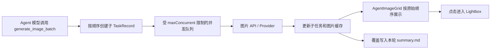

# Agent 生图网格展示、任务汇总文档与多并发可行性分析

## 1. 结论

整体可行，建议拆成两个阶段实施。

| 目标 | 可行性 | 当前基础 | 建议 |
| --- | --- | --- | --- |
| Agent 图片改为网格展示 | 高 | Agent 已能按轮次取得全部 `TaskRecord` 和图片 ID，并已接入全局图片缓存、详情页和 Lightbox | 新建轻量图片网格，不复用包含大量详情的 `TaskCard` |
| 图片悬停放大、点击查看大图 | 高 | 项目已有图片缩放过渡和全局 Lightbox，Lightbox 支持滚轮缩放、拖动及前后切换 | 网格内做轻微悬停放大，点击直接进入 Lightbox |
| 每轮任务保存一份汇总文档 | 高 | 目前已有每任务 JSON、提示词 TXT，以及每对话 Markdown | 新增每个 Agent 轮次一份 Markdown 汇总，保留现有机器可读 JSON |
| Agent 使用多并发生成 | 已具备基础能力 | `generate_image_batch` 已按图片 API 配置的 `maxConcurrent` 并发执行 | 第一阶段无需重写，只需提高触发稳定性并补齐状态展示与测试 |
| 完整复用画廊多图编排器 | 中 | 画廊已有槽位、重试、去重、补偿和异步恢复 | 不建议直接套用；应先抽取共享调度层，再适配 Agent 的“每张图不同提示词”模型 |

推荐先完成“网格 + Lightbox + 每轮汇总文档 + 稳定使用现有 Agent 批量工具”。这部分改动边界清晰，能够直接解决空间浪费和参数追溯问题。画廊高级编排能力可作为第二阶段增强。

## 2. 当前实现核查

### 2.1 Agent 为什么是一行一张任务卡

Agent 会把每个图片任务转换成 `image-task` block，再逐个渲染完整 `TaskCard`。`TaskCard` 同时包含图片、提示词、参数、状态、操作按钮等信息，因此每张图片占据一整行，且助手消息容器在桌面端还受最大宽度约束。

相关位置：

- `src/components/AgentWorkspace.tsx:151`：Assistant block 类型定义。
- `src/components/AgentWorkspace.tsx:191`：按照模型输出顺序构造图片任务 block。
- `src/components/AgentWorkspace.tsx:1210`：每个图片任务单独渲染 `TaskCard`。
- `src/components/TaskCard.tsx`：画廊任务卡同时承载图片和完整详情。

因此，不应仅给现有 `TaskCard` 外层增加 CSS Grid。这样虽然能变成多列，但详情区域仍会占空间，卡片在窄列中也会变得拥挤。正确做法是为 Agent 单独增加轻量图片单元。

### 2.2 当前已经存在 Agent 并发

Agent API 已向模型注册 `generate_image_batch` 工具，并明确要求独立图片在同一个批次中生成。收到该工具调用后，应用会：

1. 先按模型给出的顺序创建所有图片任务；
2. 再通过 `runWithConcurrencyAndRetry` 启动并发 worker；
3. 并发上限读取图片 API 配置的 `imageProfile.maxConcurrent`；
4. 每张图片仍保存为独立的 `TaskRecord`，并用相同的 `agentBatchCallId` 关联。

相关位置：

- `src/lib/agentApi.ts:156`：注册 `generate_image_batch`。
- `src/store.ts:6243`：执行 Agent 批量图片工具。
- `src/store.ts:6273`：并发和重试入口。
- `src/store.ts:6275`：复用图片配置中的最大并发数。
- `src/lib/imageApiShared.ts:218`：通用并发 worker。

所以“Agent 能否多并发”的答案是：**已经可以**。但它依赖模型正确调用批量工具；单张工具调用仍逐个执行，多个批量工具调用之间也按顺序处理。用户感知上的“一行一张”是展示问题，不代表请求一定是串行。

### 2.3 Agent 并发与画廊多图编排的差异

画廊并发并不只是 `Promise.all`，还包含：

- 固定数量的生成槽位；
- 根据服务商能力决定单请求 `n` 数量；
- 最大并发控制；
- 指数退避重试；
- 完全重复和近似重复检测；
- 缺图补偿；
- fal / 自定义异步任务恢复；
- 结果乱序完成后仍按槽位排序。

这些能力集中在 `src/lib/imageBatchOrchestrator.ts` 和 `src/store.ts:6854` 之后的画廊生成流程。

两种数据模型不同：

- 画廊：一个任务、一个提示词、`n` 个槽位。
- Agent 批量：一个批次中有多个独立提示词，每张图是一个独立任务，批次由 `agentBatchCallId` 关联。

因此，画廊编排器不能原样套到 Agent 上。直接复用会迫使 Agent 把不同提示词合并成一个画廊任务，破坏任务追踪、引用关系和单图重试。

## 3. 推荐界面方案

### 3.1 展示单位

在每条 Agent 助手消息中，把同一次批量调用或相邻的图片任务合并为一个 `AgentImageGrid`：

- 完成任务：只展示图片；
- 运行任务：保留同尺寸骨架和轻量进度状态；
- 失败任务：保留同尺寸失败占位和重试入口，否则用户无法判断缺图原因；
- 已删除任务：保留小型删除占位，避免输出顺序发生误解。

`TaskCard` 继续用于画廊，不修改其职责。Agent 网格直接消费 `TaskRecord[]`，避免影响画廊现有功能。

### 3.2 桌面布局

仅考虑 PC 桌面端，建议：

```css
grid-template-columns: repeat(auto-fill, minmax(180px, 1fr));
```

- 单轮最多显示 4 列，具体列数由 Agent 中央区域宽度自动决定；
- 图片单元按任务请求比例设置 `aspect-ratio`，避免固定正方形大量裁切；
- 图片使用 `object-cover`，悬停时在单元内部轻微放大至约 `1.03`；
- 单元使用 `overflow: hidden`，避免放大后覆盖相邻图片；
- 助手消息中包含图片网格时，将桌面最大宽度由当前约 75% 放宽到 90% 或可用宽度上限。

### 3.3 大图交互

建议沿用项目全局 Lightbox：

- 单击任意图片直接打开大图，不再先进入任务详情；
- Lightbox 图片列表传入当前轮次全部已完成图片，支持前后切换；
- 沿用现有滚轮缩放和鼠标拖动；
- 网格悬停只做轻微视觉放大，不新增跟随鼠标的大型浮层，避免遮挡其他图片和产生边缘定位问题。

这里需要区分两个动作：网格悬停是轻微放大反馈；真正的细节查看由现有 Lightbox 完成。该行为与当前画廊体系兼容，实施风险最低。

### 3.4 操作入口

“只展示图片”不代表删除现有能力。建议把整轮操作保留在助手消息底部：收藏全部、下载全部、重新生成、删除消息。单图复用、编辑输出、删除等低频操作可放入图片右键菜单或悬停菜单，但第一阶段可以不增加，保持最小实现。

## 4. 每轮任务汇总文档方案

### 4.1 当前保存能力

当前本地保存已经包含：

- `tasks/<taskId>.json`：每个图片任务的机器可读元数据；
- `prompts/<taskId>.txt`：每个图片任务的提示词；
- `agent/<conversationId>.md`：整段对话文本。

现有对话 Markdown 只记录用户/助手文本、轮次状态和时间，不包含各图片任务的请求参数、实际参数、模型、输出文件和失败详情，因此无法替代界面中被移除的详情。

相关位置：

- `src/lib/localSave.ts:307`：保存任务 JSON。
- `src/lib/localSave.ts:363`：格式化对话 Markdown。
- `src/lib/localSave.ts:407`：保存对话 Markdown。
- `src/store.ts:431`：对话完成后触发本地保存。

### 4.2 推荐文件粒度

“一次 Agent 任务”建议定义为一个 `AgentRound`，而不是单个子图片 `TaskRecord`。因为一个用户请求可能生成多张图片，用户需要的是这一轮的完整汇总。

推荐路径：

```text
agent/
  <conversationId>.md
  <conversationId>/
    round-001-<roundId>.md
    round-002-<roundId>.md
```

这样既保留整段对话文档，也能为每一轮生成任务提供独立、稳定的汇总文件。

### 4.3 汇总内容

每份轮次文档建议包含：

1. 对话 ID、标题、轮次 ID、分支父轮次；
2. 用户原始请求；
3. 输入参考图 ID、蒙版图和引用关系；
4. 轮次开始、结束、耗时和最终状态；
5. 图片任务总数、成功数、失败数；
6. 每张图片的任务 ID、完整提示词；
7. 请求参数与 API 实际生效参数；
8. Provider、配置名称、API 模式和模型；
9. 输出图片本地路径、原始 URL和改写后的提示词；
10. 错误、重试和部分失败信息。

不应写入 API Key、Authorization Header、图片 base64 或完整超大原始响应。原始响应继续保留在任务数据中用于诊断，Markdown 只写可读摘要。

### 4.4 写入时机

建议在以下节点覆盖写入同一份 Markdown：

- 轮次创建后：写入初始请求和输入信息；
- 图片子任务创建后：补充任务列表和请求参数；
- 单个子任务完成或失败后：更新结果计数和对应行；
- 整轮完成、停止或失败后：写入最终状态。

不要在每个流式预览帧写文件。可以按任务状态变化触发，并用现有本地保存队列或简单 debounce 合并短时间内的重复写入，避免并发完成时互相覆盖。

## 5. 并发落地建议

### 第一阶段：保留现有 Agent 并发

第一阶段建议继续使用 `generate_image_batch + runWithConcurrencyAndRetry`，原因是它已经满足不同提示词并行生成，并且使用当前画廊图片 API 配置中的最大并发数。

需要补强：

- 测试并发峰值不超过 `maxConcurrent`；
- 测试结果乱序完成后，网格仍按模型给出的顺序展示；
- 测试单个失败不会中断整个批次；
- 明确停止 Agent 时能中止批次中的所有请求；
- 在 Agent 指令中继续要求独立多图使用一个 `generate_image_batch`；
- 汇总文档记录批次 ID 和每个子任务结果。

### 第二阶段：共享画廊的高级调度能力

若希望 Agent 也获得画廊的异步恢复、去重和缺图补偿，应抽取一个与 Zustand、DOM 和具体任务模型无关的共享调度层：

```text
Gallery Task ─┐
              ├─ Generation Scheduler ─ Provider Adapter
Agent Batch ──┘
```

共享层负责并发令牌、错误分类、指数退避、远端请求恢复和取消；画廊槽位规则继续留在画廊编排器，Agent 则用 `agentBatchCallId + child TaskRecord` 适配。

不建议让 Agent 直接复用画廊的近似重复判定。Agent 经常有“同风格系列图”的需求，近似度过高不一定是错误。默认只启用完全重复检测，近似重复应保持关闭或由批次策略显式开启。

## 6. 数据流建议



## 7. 主要风险与处理

| 风险 | 影响 | 处理建议 |
| --- | --- | --- |
| 模型没有调用批量工具 | 多图仍可能串行 | 保留明确工具指令，并增加多图请求的行为测试；后续可增加应用侧批量规划兜底 |
| 助手消息最大宽度限制网格列数 | 桌面仍只能显示 2–3 列 | 仅对含图片网格的助手消息放宽宽度 |
| 图片比例不同导致网格跳动 | 生成过程中布局不稳定 | 从任务参数预先计算 `aspect-ratio`，加载后再用实际尺寸校正 |
| 并发任务同时写汇总文档 | 后完成的数据覆盖先完成的数据 | 每次从最新 store 构建完整文档，并串行/防抖写入 |
| 删除任务后文档与 UI 不一致 | 追溯信息丢失或过期 | 删除后立即重建汇总文档，并将删除状态写入对应任务项 |
| 直接复用画廊编排器 | 不同提示词被错误合并 | 只共享底层调度能力，不共享画廊的单提示词槽位模型 |

## 8. 建议实施顺序与验收标准

### 阶段 A：图片网格

- 新增 `AgentImageGrid` / `AgentImageTile`；
- 按批次或相邻图片任务合并 block；
- 展示完成、运行、失败和删除状态；
- 点击进入当前轮次 Lightbox；
- 保留整轮收藏、下载、重试和删除操作。

验收：1920×1080 下同一轮 4 张方图至少可稳定显示 3–4 列；页面不再出现一张图占一整行；点击、滚轮缩放、拖动和前后切换正常。

### 阶段 B：任务汇总文档

- 新增轮次 Markdown formatter 和保存函数；
- 在轮次和子任务关键状态变化时更新；
- 补齐路径、失败和实际参数测试。

验收：一次包含成功、失败、不同实际参数的多图任务结束后，只生成一份对应轮次的汇总文档，内容与 store 和本地图片路径一致，且不包含密钥和 base64。

### 阶段 C：并发稳定性

- 为现有 Agent batch 增加并发上限、乱序、部分失败和停止测试；
- 根据测试结果决定是否抽取共享调度器。

验收：请求峰值不超过配置值，完成顺序不影响展示顺序，单图失败不阻断其他图片，停止操作能终止未完成请求。

## 9. 最终建议

本需求不需要先重构整条生图链路。建议优先落地阶段 A 和 B，同时保留并验证现有 Agent 多并发。只有在明确需要画廊的“异步恢复、缺图补偿、去重”等高级能力时，再进入阶段 C 的共享调度器改造。

这一方案能以较小改动解决当前最明显的空间浪费问题，并把从界面移除的参数详情转移到可长期追溯的轮次文档中，同时避免破坏 Agent 已经存在的多提示词并发模型。
