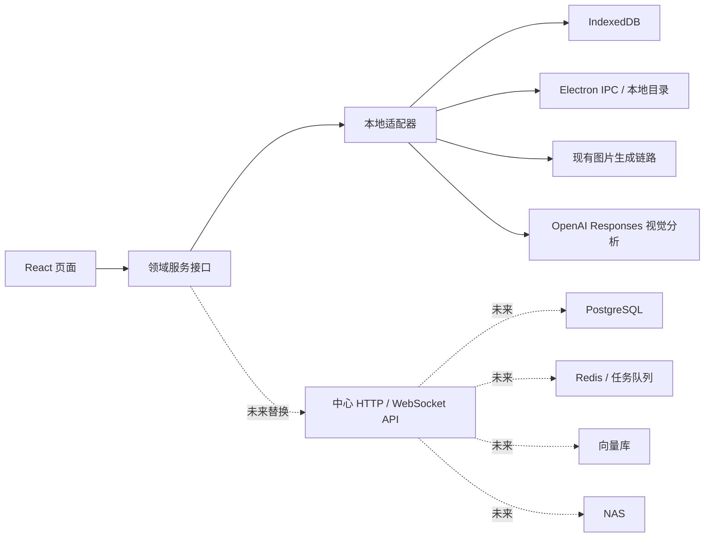
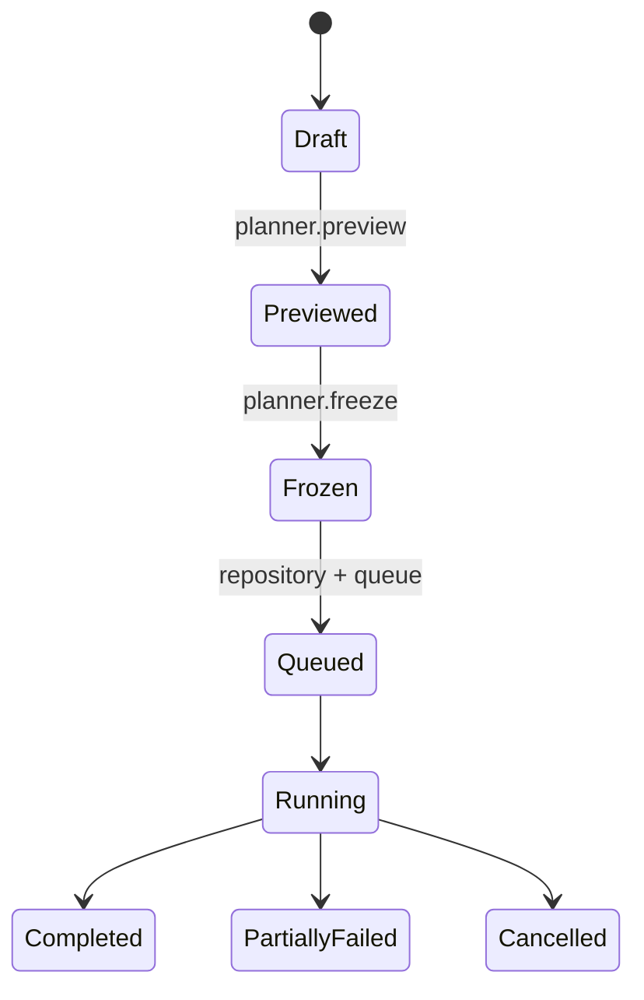
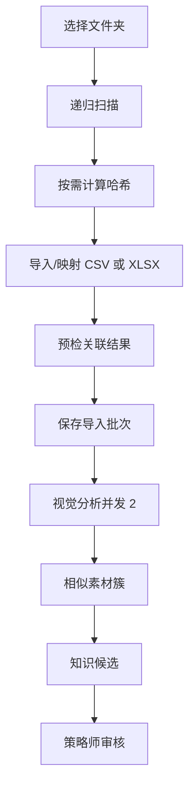

# 需求下单本地原型：技术实施计划

> 关联 PRD：[requirement-ordering-local-prototype-prd.md](./requirement-ordering-local-prototype-prd.md)  
> 状态：待技术评审  
> 原则：复用现有生成链路，新增领域边界，不提前实现中心服务

## 1. 技术结论

第一阶段继续使用当前 Electron、React、TypeScript、Zustand 和 IndexedDB。

实施采用四个独立领域：

```text
Auth            本地模拟账号、会话和权限
Orders          下单、拆单、队列、进度、结果
Strategy        产品/渠道/类型/规则版本与审批
Knowledge       素材导入、视觉分析、知识审核
```

管理员控制台聚合四个领域的数据，不拥有另一套业务状态。

现有 `appMode` 继续只管理画廊、Agent、后期处理。新增 `shellRoute` 管理需求系统顶层页面，避免把订单、策略和管理页错误地落入 `setAppMode()` 的 Agent 分支。



## 2. 代码组织

建议新增：

```text
src/features/auth/
  types.ts
  permissions.ts
  localAuthService.ts
  authStore.ts
  LoginPage.tsx
  RouteGuard.tsx

src/features/requirementOrders/
  types.ts
  constants.ts
  catalogRanking.ts
  planner.ts
  promptComposer.ts
  quota.ts
  eta.ts
  orderRepository.ts
  localOrderRepository.ts
  localGenerationQueue.ts
  outputManifest.ts
  orderStore.ts
  RequirementOrderPage.tsx
  MyOrdersPage.tsx
  OrderDetailPage.tsx
  RequirementQueueRunner.tsx
  components/

src/features/strategyCenter/
  types.ts
  versioning.ts
  validation.ts
  strategyRepository.ts
  localStrategyRepository.ts
  strategyStore.ts
  StrategyCenterPage.tsx
  StrategyEditorPage.tsx
  ApprovalQueuePage.tsx
  components/

src/features/knowledgeBase/
  types.ts
  fileImport.ts
  metricImport.ts
  metricCalculation.ts
  evidenceClassification.ts
  analysisSchema.ts
  analysisService.ts
  openAiAnalysisService.ts
  knowledgeRepository.ts
  localKnowledgeRepository.ts
  knowledgeStore.ts
  KnowledgeImportPage.tsx
  AnalysisBatchPage.tsx
  KnowledgeReviewPage.tsx
  components/

src/features/admin/
  AdminDashboardPage.tsx
  UserManagementPage.tsx
  ModelSettingsPage.tsx
  AuditLogPage.tsx

src/features/appShell/
  types.ts
  shellStore.ts
  AppShell.tsx
  RoleNavigation.tsx

src/lib/requirementDb.ts
src/lib/requirementFs.ts
src/lib/requirementNotifications.ts

electron/requirement-ipc.ts
```

测试文件与纯逻辑文件同目录，遵循现有 `*.test.ts` / `*.test.tsx` 习惯。

## 3. 与现有代码的接入点

### 3.1 `src/App.tsx`

调整为：

```text
启动初始化
→ AuthGate
→ AppShell
   ├─ 新需求系统页面
   └─ LegacyToolsHost
      └─ 现有 Header / Gallery / Agent / Postprocess
```

必须继续挂载：

- 现有 Toast、ConfirmDialog 和设置弹窗。
- 新增 `RequirementQueueRunner`。
- 新增分析批次 runner。

### 3.2 `src/store.ts`

仅做生成链路所需的最小扩展：

- `submitTaskWithData` 接受可选的需求来源元数据。
- 支持不把需求任务加入当前画廊标签页。
- 返回稳定 `taskId`，保持现有调用兼容。
- 任务更新时允许需求队列订阅状态。

建议新增参数：

```ts
interface RequirementTaskContext {
  orderId: string
  unitId: string
  plannedImageId: string
  imageOrdinal: number
}

interface SubmitTaskWithDataOptions {
  // 保留现有字段
  requirementContext?: RequirementTaskContext
  attachToWorkspace?: boolean
}
```

`attachToWorkspace` 默认 `true`，只有需求队列显式传 `false`。

### 3.3 `src/types.ts`

`TaskRecord` 新增可选字段：

```ts
requirementOrderId?: string
requirementUnitId?: string
requirementPlannedImageId?: string
requirementImageOrdinal?: number
```

`sourceMode` 扩展为：

```ts
sourceMode?: AppMode | 'requirement-order' | 'strategy-test'
```

不扩展 `AppMode`，避免破坏现有 `setAppMode()` 分支。

### 3.4 `src/lib/db.ts`

当前数据库版本为 6。实施时升级到 7，并新增需求域对象仓库，或在独立 `requirementDb.ts` 中复用同一数据库升级入口。

禁止从两个模块分别调用 `indexedDB.open()` 并各自维护版本；数据库升级必须只有一个入口。

建议对象仓库：

```text
requirement_users
requirement_configs
requirement_orders
requirement_assets
requirement_analysis
requirement_knowledge
requirement_events
```

推荐索引：

```text
requirement_orders: createdBy, status, createdAt
requirement_assets: sha256, productId, channelId
requirement_analysis: assetId, modelProfileId
requirement_knowledge: status, evidenceType, updatedAt
requirement_events: actorId, action, createdAt
```

升级失败必须保留旧对象仓库，不删除用户现有任务和图片。

### 3.5 Electron IPC

现有文件 IPC 已覆盖目录选择、读取、保存和打开目录。知识库递归扫描需要一个受限的新 IPC：

```ts
scanKnowledgeDirectory(input: {
  rootPath: string
  extensions: string[]
}): Promise<Array<{
  absolutePath: string
  relativePath: string
  name: string
  size: number
  modifiedAt: number
}>>
```

要求：

- 仅扫描用户通过目录选择器授权的根目录。
- 过滤 `jpg/jpeg/png/webp`。
- 不跟随目录外的符号链接。
- 返回元数据，不一次返回所有图片二进制。
- 图片二进制按分析任务逐张读取。

清单写入继续使用安全路径校验和原子替换。

### 3.6 API 配置

现有图片 API Profile 继续作为生图配置来源。

新增管理员专用的分析 Profile：

```ts
interface AnalysisApiProfile {
  id: string
  name: string
  baseUrl: string
  apiKey: string
  model: string
  timeout: number
  maxConcurrent: number
  maxRetries: number
}
```

第一阶段向量模型保留配置和连通性测试接口；若尚未实现真实向量服务，聚类先使用视觉分析标签和可测试的本地特征适配器，不伪装为远程向量检索。

## 4. 数据与状态设计

### 4.1 配置版本不可变

发布操作创建不可变版本。业务实体和版本分离：

```text
StrategyEntity
  id
  type
  currentPublishedVersionId
  archivedAt

StrategyVersion
  id
  entityId
  version
  status
  payload
  createdBy
  approvedBy
  timestamps
```

订单只引用版本 ID 和冻结 payload，不在运行时查询“当前版本”。

### 4.2 订单规划是纯函数

`planner.ts` 不读取 DOM、Zustand、IndexedDB 或 API。

输入：

- 下单草稿。
- 已发布目录。
- 当前用户额度。
- 系统上限。

输出：

- 有效组合。
- 排除组合和原因。
- 总图片数。
- 配额占用。
- 是否可提交。

相同输入必须得到相同输出，便于测试和未来服务端复用。

### 4.3 规划和执行分离



用户提交后冻结 `FrozenOrderPlan`。之后发布新规则、修改产品或知识不得改变该计划。

### 4.4 图片级计划

主动差异化要求每张图片有独立计划：

```ts
interface PlannedRequirementImage {
  id: string
  unitId: string
  ordinal: number
  strategyMode: 'fixed' | 'intelligent'
  knowledgeMode?: 'stable' | 'exploratory'
  variationAxes: string[]
  prompt: string
  status: PlannedImageStatus
  taskId?: string
  attempts: number
}
```

最多 500 个计划对象可以在 IndexedDB 中保存，但 UI 不一次渲染 500 张原图。

### 4.5 额度账本

不要只在用户记录上存“剩余额度”，使用账本事件：

```text
reserve   下单占用
release   取消未执行任务
grant     管理员临时追加
reset     每日重置
```

剩余额度由当天基础额度和事件汇总得到。这样可以审计取消、追加和重跑。

## 5. 下单实现

### 5.1 个性化排序

本地记录用户选择事件：

```ts
interface CatalogUsageEvent {
  userId: string
  kind: 'product' | 'channel' | 'material-type' | 'combination'
  targetIds: string[]
  usedAt: number
}
```

推荐分数保持简单、可解释：

```text
score = 使用次数权重 + 最近使用衰减 + 管理员默认排序
```

第一阶段不引入推荐模型。

### 5.2 多选卡片

卡片使用真实 `button` 或带正确 ARIA 状态的控件：

- `aria-pressed` 表示选中。
- 空格和 Enter 可以切换。
- 禁用项使用 `disabled` 和原因文本。
- 规格按钮嵌在渠道卡片中，但事件需要避免冒泡造成渠道误取消。

### 5.3 提交

提交顺序：

1. 重新执行 planner，防止目录在页面打开期间变化。
2. 校验当前用户、额度和上限。
3. 冻结版本快照。
4. 原子保存订单和额度占用事件。
5. 写初始 manifest。
6. 将订单加入本地队列。
7. 导航到需求详情。

如果第 4 步失败，不得启动生成。

## 6. 生成队列实现

### 6.1 Runner

`RequirementQueueRunner` 与现有 `AgentBatchQueueRunner` 类似，作为无 UI 后台组件挂载，但业务状态保存在仓库中。

Runner：

- 读取待运行订单。
- 按普通/紧急优先级取任务。
- 遵守管理员并发设置。
- 调用 prompt composer。
- 调用现有 `submitTaskWithData`。
- 监听 `TaskRecord` 状态。
- 更新图片计划、订单聚合和清单。

### 6.2 调度粒度

为了保证每张图片主动差异化，第一阶段每个 `PlannedRequirementImage` 提交一个 `n = 1` 的现有任务。

控制措施：

- 不一次创建 500 个远程请求。
- 只为当前并发窗口创建任务。
- 完成一个再取下一个。
- `attachToWorkspace: false`，不污染画廊标签页。

### 6.3 重试

- 现有 API 层重试与需求层重试需要区分。
- 需求层最多重新创建 2 次执行尝试。
- 每次尝试记录 `taskId` 和错误。
- 不得因为 renderer 重绘而重复提交。
- 使用稳定 `plannedImageId` 做幂等键。

### 6.4 取消

取消订单时：

1. 将订单置为 `cancelling`。
2. 不再领取新计划图片。
3. 尝试停止正在执行的现有任务。
4. 保留成功图片。
5. 将未开始项置为 `cancelled`。
6. 写额度释放事件。
7. 更新清单和审计日志。

### 6.5 ETA

本地维护最近成功任务耗时样本：

- 按模型和规格分组。
- 使用移动中位数，降低极端超时影响。
- 样本不足时使用管理员默认耗时。
- 返回区间而不是虚假精确时间。

## 7. 提示词实现

### 7.1 结构化中间表示

不要直接拼接多段任意字符串。先生成：

```ts
interface PromptPlan {
  subject: string[]
  productFacts: string[]
  audience: string[]
  channelRequirements: string[]
  aspectRatioRequirements: string[]
  compositionRules: string[]
  copyRules: string[]
  visualRules: string[]
  variationInstructions: string[]
  negativeRules: string[]
  evidenceRefs: string[]
}
```

再由 renderer 生成最终提示词。

### 7.2 冲突检测

固定规则、渠道和产品配置使用结构化字段标记：

- `required`
- `preferred`
- `forbidden`
- `allowedVariations`

冲突检测优先处理 `forbidden`。不能仅靠自然语言模型自行解决硬冲突。

### 7.3 80/20 分配

对于每个智能组合：

```text
stableCount = round(total × stableRatio)
exploratoryCount = total - stableCount
```

必须保证：

- 有潜力知识时才分配探索任务。
- 没有潜力知识时全部使用稳定知识。
- 没有任何已发布知识时使用类型通用策略，并在快照中记录回退。

## 8. 输出与清单

### 8.1 原子写入

每次更新：

```text
写入 manifest.json.tmp
→ flush/close
→ 替换 manifest.json
```

HTML 和 XLSX 使用同样的临时文件策略。

### 8.2 XLSX

实现时新增一个明确的应用依赖用于 XLSX 读写；不要依赖 Codex 开发环境自带库。

选择依赖时验证：

- Electron 打包兼容。
- 读取和写入基础工作表。
- 不在 renderer 中执行不必要的大对象转换。

### 8.3 HTML 概览

生成自包含静态 HTML：

- 不引用外部 CDN。
- 不包含 API 密钥和完整提示词。
- 显示需求、组合、状态和文件链接。
- 对路径和业务文本做 HTML 转义。

## 9. 素材导入与分析

### 9.1 导入流水线



### 9.2 哈希策略

- 扫描阶段先用路径、大小和修改时间快速判断候选。
- 真正导入时计算 SHA-256。
- SHA-256 是去重依据，文件名不是。
- 哈希计算不能阻塞 UI 主线程；使用 Electron 主进程或 Web Worker。

### 9.3 Excel/CSV 映射

导入器将来源表映射为标准行：

```ts
interface StandardPerformanceRow {
  imageReference: string
  product?: string
  channel?: string
  materialType?: string
  date?: string
  impressions: number
  clicks: number
  conversions: number
}
```

预检后才写入，错误行不进入指标库。

### 9.4 Responses 分析

单张请求包含：

- 图片。
- 产品与渠道标签。
- 固定 JSON 输出要求。
- 合规与 OCR 维度。

处理：

1. 解析 JSON。
2. schema 校验。
3. 失败时执行一次结构修复请求。
4. 仍失败则进入可重试错误。
5. 保存原始文本、结构化结果和模型信息。

不得因为部分字段缺失而编造默认结论。

### 9.5 聚类

第一阶段分两档：

- 有真实向量特征适配器：使用向量相似度 + 产品/渠道过滤。
- 无真实向量适配器：使用结构化标签 Jaccard/加权相似度形成可测试本地簇。

UI 必须标明当前使用“向量聚类”还是“标签聚类”。

## 10. 安全与权限

### 10.1 本地密码

模拟账号密码也不明文持久化。使用 Web Crypto：

- 随机 salt。
- PBKDF2 或等价安全散列。
- 常量时间语义的校验流程。

演示账号 seed 时生成散列。

### 10.2 API 密钥

- 仅管理员页面读取和编辑。
- 不进入普通 Zustand DevTools 可见状态。
- Toast、审计日志、HTML、XLSX 和 manifest 不记录密钥。
- 导出配置默认移除密钥。

### 10.3 UI 权限不是唯一防线

所有领域服务方法都再次校验当前角色。隐藏菜单不能替代服务层授权。

## 11. 测试矩阵

### 11.1 纯逻辑测试优先

优先完成：

```text
planner.test.ts
promptComposer.test.ts
quota.test.ts
eta.test.ts
versioning.test.ts
permissions.test.ts
metricImport.test.ts
metricCalculation.test.ts
evidenceClassification.test.ts
outputManifest.test.ts
```

### 11.2 组件测试

- 多选卡片键盘和鼠标行为。
- 渠道规格嵌套按钮。
- 下单摘要。
- 排除组合详情。
- 角色导航。
- 任务树默认展开异常节点。
- 知识批量审核。
- 权限禁止页。

### 11.3 集成测试

使用现有 Mock Image API 验证：

- 生成成功。
- 部分失败。
- 超时。
- 重试。
- 取消。
- 结果保存。

分析服务使用固定 mock 响应验证：

- 正常 JSON。
- 缺字段 JSON。
- Markdown 包裹 JSON。
- 无法修复响应。
- 超时和限流。

### 11.4 每阶段验证命令

```powershell
npm.cmd test
npm.cmd run build
```

高风险阶段运行相关测试后，再运行全量测试和构建。

## 12. 交付切片与依赖

| 切片 | 依赖 | 可独立演示的结果 |
| --- | --- | --- |
| A. Auth + AppShell | 无 | 三种角色登录和导航 |
| B. Strategy Catalog | A | 配置草稿、审批和发布 |
| C. Order Planner | A+B | 鼠标下单和组合预览 |
| D. Generation Queue | C | 真实生成、进度和结果 |
| E. Order History | D | 我的需求、详情和复制 |
| F. Knowledge Import | A+B | 文件夹、数据映射和分析 |
| G. Knowledge Review | F | 聚类、审核和发布 |
| H. Admin + QA | A–G | 监控、审计和完整验收 |

每个切片完成后应可运行，不提交只有静态页面、没有数据闭环的大批量代码。

## 13. 关键技术决策

1. 不扩展现有 `AppMode` 承载新系统导航。
2. 不复制现有图片 API 客户端。
3. 不在组件中实现拆单、配额和规则优先级。
4. 不让运行中的订单引用可变的“当前规则”。
5. 不一次向 API 提交 500 个请求。
6. 不把原始图片批量存入新业务对象；继续使用文件系统和现有图片存储。
7. 不把 localStorage 当作订单或知识库主存储。
8. 不声称本地标签聚类等同于生产向量检索。
9. 不在第一阶段实现伪中心服务或伪 NAS。
10. 所有未来远程能力通过适配器替换，而不是重写页面。

## 14. 完成定义

技术实施完成需满足：

- PRD 第 20 节全部验收项通过。
- 新增领域纯逻辑具备单元测试。
- 现有测试无回归。
- `npm.cmd run build` 成功。
- IndexedDB 升级不丢失现有任务、图片、词库或工作区数据。
- 真实生成和 Mock API 两种路径均验证。
- 视觉分析正常、异常和恢复路径均验证。
- 1280 × 720、1440 × 900、亮色、暗色和减少动画模式完成 UI 检查。
- 代码中不存在硬编码 API 密钥。
- 规则、知识和订单快照可从审计记录追溯。

