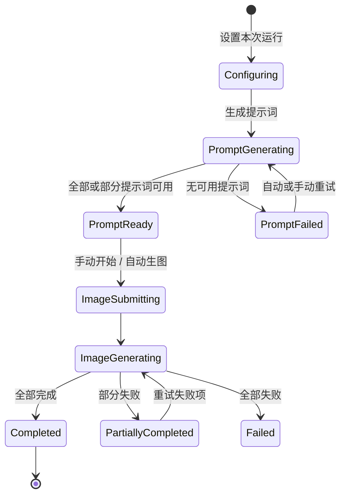

# SOP 生图交互改造方案

## 1. 文档状态

- 状态：需求已确认，待进入实现
- 范围：画廊中的 SOP 选择、批量提示词生成、批量生图、后台进度和结果复盘
- 技术栈：React 19、Zustand、IndexedDB、Tailwind CSS
- 现有实现参考：
  - `src/components/InputBar.tsx`
  - `src/features/strategy/SopPresetPickerModal.tsx`
  - `src/features/strategy/SopManagementCenter.tsx`
  - `src/features/strategy/adapters/GallerySopBatchModal.tsx`
  - `src/components/SopBatchTaskCard.tsx`
  - `src/components/SopBatchDetailModal.tsx`
  - `docs/gallery-sop-batch-task-card-implementation.md`

## 2. 已确认的产品决策

| 主题 | 决策 |
| --- | --- |
| SOP 与本次输入 | SOP 是长期模板；“本次生成要求”只影响当前批次，不回写 SOP |
| 本次生成要求 | 可选；留空时完全按 SOP 执行 |
| 运行方式 | 使用开关控制“审核提示词后生图 / 提示词完成后自动生图” |
| 数量 | 拆为“提示词数量”和“每条生成图片数” |
| 总量提示 | 实时显示预计图片总数：提示词数量 × 每条图片数 |
| 多参考图策略 | 默认“共同参考”，不再默认只取前三张或平均拆分 |
| 参考图使用阶段 | 提示词生成和最终生图都使用全部共同参考图 |
| 提示词选择 | 不提供部分勾选；所有有效提示词默认参与生图 |
| 提示词操作 | 支持编辑、删除、单条重新生成和手动新增 |
| 草稿 | 自动保存；关闭后可继续 |
| 正式批次 | 开始生图时冻结不可变快照 |
| SOP 选择与管理 | 不拆成两个产品入口，在同一面板内通过布局和层级降低复杂度 |
| SOP 应用 | 条目提供明确的“应用”图标；点击后立即应用，不二次确认 |
| SOP 预览与编辑 | 合并为始终可编辑的详情区；修改 SOP 时仍需明确保存 |
| 后台任务 | 关闭工作台后继续运行，并在输入区持续显示进度 |
| 重试 | 提示词生成自动重试最多 2 次；生图失败由用户手动批量重试 |
| 结果结构 | 默认按提示词分组；可切换紧凑的全部图片总览 |
| 全部图片总览 | 使用小缩略图和现有鼠标指针预览，不展示大卡片和长提示词 |

## 3. 当前流程与关键问题

### 3.1 当前流程


### 3.2 必须优先修正的问题

1. `InputBar` 打开 `GallerySopBatchModal` 时没有传入当前输入文本，`initialBrief` 实际保持空字符串。“本次生成要求”和 `@图N` 无法可靠参与生成。
2. 普通模式中的“数量”在 SOP 模式中被隐式解释成提示词数量，用户无法区分提示词数和每条图片数。
3. 参考图默认只取前三张并进行数量分配，但界面没有解释这一规则。
4. 提示词列表提示用户返回“SOP 设置弹窗”，当前却只有 SOP 选择器和普通参数区，信息架构不一致。
5. 提示词生成完成后已经写入本地草稿，但界面仍显示“保存列表”，保存语义重复。
6. 批次详情当前按子任务平铺；支持每条提示词多张图片后，需要按提示词组织多个输出图片。
7. SOP 选择器把预览、编辑、复制、移动和应用全部挤在列表条目上，操作密度高。

## 4. 目标用户心智

用户只需要理解四个阶段：

1. **设置本次运行**：选择 SOP、填写本次要求、确认共同参考图和数量。
2. **生成提示词**：AI 执行 SOP，用户可查看、编辑或重生成。
3. **批量生图**：全部有效提示词开始生图，后台持续显示进度。
4. **查看与复用结果**：按提示词查看变体，失败项重试，整批设置可再次运行。



## 5. 目标交互

### 5.1 输入区：本次运行设置

启用 SOP 后，输入区从“直接生图”切换为“SOP 运行”语义。

#### 可见内容

- SOP 状态胶囊：`SOP · 信息流合规基础`
- 本次输入标签：`本次生成要求（可选）`
- 输入占位文案：`补充本批次的主题、内容和限制；留空则完全按 SOP 执行`
- 提示词数量
- 每条图片数
- 总量摘要：`10 条提示词 × 每条 2 张 = 预计 20 张图片`
- 共同参考图摘要：`共同参考 · 4 张`
- 开关：`提示词完成后自动生图`
- 主按钮：
  - 审核模式：`生成 10 条提示词`
  - 自动模式：`生成提示词并自动生图`

#### 行为规则

1. 本次生成要求必须原样传入提示词生成请求。
2. SOP 模式不再复用普通模式的单一“数量”字段作为唯一数量入口。
3. `提示词数量` 范围沿用现有限制 1–50。
4. `每条图片数` 使用当前图片 Provider 支持的 `n` 上限；界面按活动 API Profile 动态限制。
5. 总图片数只用于展示预计输出量，不把“图片数”错误描述成“任务数”。
6. 总图片数达到高用量阈值时，在主按钮上方显示费用风险提示，并在提交前再次确认数量。
7. 自动生图开关默认关闭，并记住当前工作区上次选择。
8. 未选择 SOP、SOP 正文为空、文本模型未配置、图片模型未配置或参考图超过 Provider 限制时，在相关控件附近显示错误，不等到提交后再报错。

### 5.2 参考图：共同参考

#### 默认规则

- 当前输入区中的所有参考图组成一组共同参考。
- 全部参考图都传给提示词生成模型。
- 每一个最终生图子任务也携带同一组参考图。
- 不再静默截断为前三张，不再把提示词平均分配给不同参考图。

#### 限制处理

1. 提交前读取当前 Provider 的参考图数量限制。
2. 超限时阻止提交，明确显示“当前模型最多支持 N 张参考图”。
3. 用户必须主动移除图片或切换模型；系统不得静默丢弃参考图。
4. 批次快照记录参考图 ID 和提交时的顺序。
5. 再次运行时若参考图已被删除，展示缺失项并阻止直接运行，允许用户补图后继续。

### 5.3 统一 SOP 面板

保留“选择与管理在同一面板”的产品结构，改成三栏布局。

#### 左栏：导航与筛选

- 搜索
- 最近使用
- 收藏
- 全部 SOP
- SOP 分组
- 未分组
- 新建分组

建议宽度：200–240px。

#### 中栏：SOP 列表

每个条目展示：

- 名称
- 一行说明
- 分组或来源标签
- 当前应用状态
- “应用”图标

行为：

- 点击条目正文：在右栏打开该 SOP。
- 点击“应用”图标：立即应用该 SOP。
- 已应用条目显示清晰的勾选状态。
- 应用成功后面板保持打开，顶部同步显示当前 SOP。
- 编辑、复制、移动和删除不触发应用。
- 列表不再同时铺开所有管理按钮；低频操作放到右栏。

建议宽度：320–380px。

#### 右栏：可编辑详情

预览和编辑合并，字段始终可编辑：

- 名称
- 所属分组
- 说明
- SOP 正文

行为：

- 修改后显示`未保存`。
- 右上角固定`保存`按钮。
- 支持 `Ctrl+S` / `Cmd+S`。
- 名称和正文为空时就地显示错误。
- 切换 SOP、关闭面板或进入智能生成前，如果有未保存修改，询问是否放弃。
- 保存成功后显示短暂成功反馈。
- 复制、移动和删除集中在详情区顶部的次级操作区。
- 删除必须二次确认，并说明是否影响当前已应用状态；历史批次快照不受删除影响。

#### 智能生成与元指令

`SOP 库 / 生成元指令 / 智能生成`继续保留在统一面板顶部，不拆成独立产品入口。进入其他功能前先处理右栏未保存内容。

智能生成成功后：

1. 保存到指定分组。
2. 自动选中新 SOP。
3. 右栏直接展示生成结果。
4. 不自动应用，避免生成资产和本次运行状态发生隐式切换。
5. 提供明确的“应用到本次运行”图标或按钮。

### 5.4 提示词工作台

工作台是提示词生成、审核和生图提交的统一界面。

#### 顶部摘要

- SOP 名称
- 本次生成要求摘要
- 共同参考图缩略图
- `提示词数量 × 每条图片数 = 总图片数`
- 当前阶段和整体进度
- 自动生图状态

#### 提示词列表

每条提示词包含：

- 序号
- `AI 生成`或`手动添加`来源
- 可编辑文本
- `已编辑`状态
- 单条重新生成
- 删除

规则：

1. 不显示复选框，所有非空、未删除提示词默认参与生图。
2. 删除是从本次草稿中移除，不删除 SOP 资产。
3. 单条重新生成只替换当前条目，不改变其他提示词。
4. 已手动编辑的提示词在重新生成前提示会覆盖当前内容。
5. 允许手动新增提示词。
6. 草稿修改后自动保存；移除“保存列表”按钮。
7. 自动保存失败时显示持久化错误和“重试保存”，不能用成功状态掩盖失败。

#### 提示词生成进度

- 显示真实进度：`已生成 6/20`
- 单次模型请求仍可按最多 10 条拆批
- 自动重试最多 2 次
- 部分批次失败时保留已生成内容
- 错误项提供“重试缺口”
- 完全失败时提供“重新生成”，不清空本次设置

不使用无限进度条替代真实可计算进度。只有模型请求内部无法获得细粒度进度时，当前批次可以显示不确定进度，但总批次数和已完成数量必须可见。

#### 开始生图

- 审核模式主按钮：`使用 10 条提示词生成 20 张图片`
- 自动模式在提示词全部生成后自动执行同一提交逻辑
- 自动模式发生提示词缺口时停止自动生图，等待用户处理，不使用不完整列表静默提交
- 生图提交期间禁用重复提交
- 提交任何子任务前先冻结批次快照；提交成功后再把真实任务 ID 关联到该批次

### 5.5 后台状态入口

关闭工作台不会停止已开始的提示词生成或生图任务。

输入区的`列表 0`改为动态任务入口：

| 阶段 | 示例文案 |
| --- | --- |
| 提示词生成 | `生成提示词 6/20` |
| 等待审核 | `提示词待确认 20` |
| 提交生图 | `正在提交 8/20` |
| 生图进行中 | `正在生图 12/20` |
| 部分失败 | `部分失败 3 项` |
| 完成 | `已完成 20 张` |

规则：

- 点击状态入口回到当前工作台或批次详情。
- 运行中显示明确的动态状态，但遵守 `prefers-reduced-motion`。
- 用户可取消尚未开始的提交；已经发送给 Provider 的请求按现有任务取消能力处理。
- 完成或失败后使用现有浏览器/桌面通知能力。
- 切换工作区标签时，每个标签显示自己的 SOP 草稿和运行状态。

### 5.6 生图执行模型

保留现有“每条提示词一个真实 `TaskRecord`”的执行模型：

- 一条提示词对应一个子任务。
- `TaskRecord.params.n = 每条图片数`。
- 一个子任务可以输出多张图片。
- 每个子任务携带全部共同参考图。
- 所有子任务共享同一个 `sopBatch.batchId`。

这样可以复用当前多图片槽位、失败补偿、恢复、API Profile 和任务持久化能力，同时避免把 `10 × 2` 扩成 20 个重复提示词任务。

### 5.7 批量任务卡片

继续保持“一批 SOP 任务只显示一张聚合卡片”。

卡片展示：

- SOP 名称
- 本次要求的一行摘要
- `10 条提示词 · 20 张图片`
- 已完成图片数 / 总图片数
- 生成中、失败提示词数
- 最多 4 张紧凑拼贴图
- 后台运行时间
- `查看结果`
- `重试失败项`（仅有失败时）

状态计算必须基于图片槽位和子任务状态，而不是只计算子任务数量。

删除批次时说明：

- 将删除多少个子任务和多少张结果图片。
- 批次快照是否一并删除。
- 删除操作不可由单击图标直接完成，必须确认。

### 5.8 批次结果详情

提供两个视图，并记住用户上次选择。

#### 按提示词分组

默认视图。每组展示：

- 提示词序号和状态
- 可展开的完整提示词
- 该提示词生成的所有图片变体
- 单张图片的收藏、下载、继续编辑
- 整组重新生成

整组重新生成创建新的子任务或新一轮记录，不覆盖旧图片；旧结果继续属于原批次快照。

#### 全部图片总览

- 采用 100–140px 的自适应缩略图
- 使用缩略图缓存和懒加载
- 仅叠加提示词序号、变体序号和失败状态
- 不展示长提示词
- 鼠标悬停复用现有指针预览
- 点击打开现有单图详情
- 键盘聚焦后可以按 Enter 打开详情
- 触屏设备不依赖悬停，点击仍可完成主要操作

## 6. 草稿、快照与数据结构

### 6.1 当前运行草稿

继续按工作区标签保存，但扩展现有 `PersistedSopPromptRun`：

```ts
type GallerySopRunDraft = {
  version: 2
  workspaceTabId: string | null
  selectedSopId: string
  brief: string
  promptCount: number
  imagesPerPrompt: number
  autoGenerate: boolean
  referenceMode: 'shared'
  referenceImageIds: string[]
  prompts: PromptDraft[]
  generationProgress: {
    requested: number
    completed: number
    failed: number
  }
  updatedAt: number
}
```

兼容策略：

- 读取旧版 `quantity` 时迁移为 `promptCount`。
- 旧版没有 `imagesPerPrompt` 时设为 1。
- 旧版按来源分组的提示词保留文本和顺序，统一迁移到共同参考模式。
- 不删除旧 localStorage 数据，成功写入新版后再覆盖同一工作区键。

### 6.2 不可变批次快照

开始生图时创建：

```ts
type SopBatchSnapshot = {
  id: string
  batchId: string
  workspaceTabId: string | null
  createdAt: number
  sop: {
    id: string
    name: string
    description: string
    content: string
    updatedAt: number
  }
  brief: string
  referenceMode: 'shared'
  referenceImageIds: string[]
  promptCount: number
  imagesPerPrompt: number
  prompts: Array<{
    id: string
    index: number
    text: string
    origin: 'ai' | 'manual'
    edited: boolean
  }>
  params: TaskParams
  apiProfileId: string
  outputPath?: string
}
```

要求：

- 快照创建后不修改。
- 后续 SOP 被编辑或删除时，历史批次仍展示快照中的名称和正文。
- “再次运行”从快照复制出新的草稿，不修改原快照。
- 快照需要进入数据导出、备份、导入和存储清理流程。

建议新增 IndexedDB `sopBatchSnapshots` object store，并将数据库版本从 6 升级到 7。不要把完整 SOP 正文和提示词数组重复写入每一个子任务。

### 6.3 子任务元数据

扩展 `SopBatchTaskMeta`：

```ts
interface SopBatchTaskMeta {
  batchId: string
  snapshotId: string
  sopId: string
  sopName: string
  promptId: string
  promptIndex: number
  promptCount: number
  imagesPerPrompt: number
}
```

旧任务缺少新字段时：

- `snapshotId`视为不存在。
- `promptId`可以回退为任务 ID。
- `imagesPerPrompt`回退为 `task.params.n || 1`。
- 历史批次继续使用当前聚合和详情能力，不强制生成伪快照。

## 7. 重试与失败恢复

### 7.1 提示词生成

- 每个模型批次自动重试最多 2 次。
- 去重后数量不足视为缺口，不清空其他成功提示词。
- 单条重生成只请求 1 条，并把其他提示词作为去重上下文。
- 所有重试均显示当前尝试次数和最后错误。

### 7.2 生图

- 不新增隐藏的整批自动重试。
- 保留成功图片和成功子任务。
- “重试失败项”只作用于明确失败或缺失的图片槽位。
- 如果 Provider 的响应状态不确定，先使用现有恢复/查询能力，不立即重复扣费请求。
- 用户手动重试前显示失败数量和预计重新请求图片数。

## 8. 文案与状态规范

| 场景 | 文案 |
| --- | --- |
| SOP 未选择 | `选择一个 SOP 后开始批量生成` |
| 本次要求为空 | 不报错，显示`将完全按 SOP 执行` |
| 共同参考图 | `共同参考 · N 张` |
| 总量 | `预计生成 N 张图片` |
| 高用量提醒 | `本次预计生成 N 张图片，可能产生较高费用` |
| 提示词生成中 | `正在生成提示词 6/20` |
| 提示词部分成功 | `已生成 16/20，仍有 4 条缺口` |
| 待审核 | `20 条提示词待确认` |
| 生图中 | `正在生成图片 12/40` |
| 部分失败 | `已完成 37/40，失败 3 张` |
| SOP 未保存 | `有未保存修改` |
| 草稿已自动保存 | `已自动保存`，短暂显示，不持续占据界面 |

## 9. 可访问性与交互质量

1. 所有图标按钮必须有可读的 `aria-label` 和悬停提示。
2. “应用 SOP”不能只依靠颜色表达，必须同时显示勾选图标和可读状态。
3. 三栏面板的 Tab 顺序与视觉顺序一致。
4. 打开面板后焦点进入搜索或当前 SOP；关闭后回到触发按钮。
5. 未保存确认、批量删除和高用量确认必须支持键盘操作。
6. 普通正文尽量不低于 12px；关键状态和表单保持可读对比度。
7. 运行中按钮禁用并显示加载状态，防止重复提交。
8. 所有错误尽量出现在相关字段或失败分组附近，并给出恢复动作。
9. 动画使用 150–300ms，遵守 `prefers-reduced-motion`。
10. 鼠标指针预览是效率增强，不是唯一查看方式；单击和键盘仍能打开图片。

## 10. 建议的代码改动范围

| 文件 | 主要改动 |
| --- | --- |
| `src/components/InputBar.tsx` | 传递本次生成要求；拆分数量；显示 SOP 名称、共同参考、自动生图开关和后台进度 |
| `src/features/strategy/SopPresetPickerModal.tsx` | 替换为统一三栏 SOP 面板，或将能力合并到管理中心 |
| `src/features/strategy/SopManagementCenter.tsx` | 增加应用状态、应用图标、始终可编辑详情、未保存保护 |
| `src/features/strategy/adapters/GallerySopBatchModal.tsx` | 改为提示词工作台；共同参考；自动保存；真实进度；去除保存列表 |
| `src/features/strategy/sopPromptBatch.ts` | 移除默认前三张分配语义；补充共同参考和单条重生成纯函数 |
| `src/features/strategy/adapters/storeSopGeneration.ts` | 全部共同参考图进入提示词生成请求 |
| `src/types.ts` | 扩展 `SopBatchTaskMeta`，新增批次快照类型 |
| `src/lib/db.ts` | 新增批次快照 object store 与 CRUD |
| `src/store.ts` | 每条提示词以 `params.n = imagesPerPrompt`提交；全部共同参考图进入子任务 |
| `src/lib/sopBatchTaskGrouping.ts` | 按图片槽位汇总进度；兼容新旧元数据 |
| `src/components/SopBatchTaskCard.tsx` | 展示总图片进度、本次要求摘要和失败重试 |
| `src/components/SopBatchDetailModal.tsx` | 增加分组视图和紧凑总览，复用指针预览 |
| 数据导出与备份模块 | 纳入批次快照和引用图片 |

## 11. 分阶段实施

### 阶段 A：修正核心链路

范围：

- 本次生成要求真实传入。
- 数量拆为提示词数和每条图片数。
- 所有参考图作为共同参考。
- 每个子任务携带全部共同参考图。
- 增加审核/自动生图开关和总量提示。

验收：

1. 输入“夏日清爽、不要人物”后，提示词生成请求中包含该文本。
2. 10 条提示词、每条 2 张时，创建 10 个子任务并预计输出 20 张图片。
3. 4 张参考图时，提示词模型和每个生图子任务都收到这 4 张图。
4. 超过 Provider 参考图限制时，在提交前阻止并说明限制。

### 阶段 B：提示词工作台与后台状态

范围：

- 自动保存草稿。
- 移除“保存列表”。
- 单条重生成、删除、新增。
- 真实批次进度和缺口重试。
- 输入区后台状态入口。

验收：

1. 关闭再打开后，提示词和编辑内容仍存在。
2. 生成中关闭工作台，任务继续且输入区进度更新。
3. 单条重生成不改变其他提示词。
4. 部分失败后可只重试缺口。

### 阶段 C：批次快照、结果分组和失败重试

范围：

- 不可变批次快照。
- 每条提示词多图片结果分组。
- 紧凑全部图片总览。
- 手动重试失败图片。
- 再次运行。

验收：

1. 修改或删除原 SOP 后，历史批次仍展示提交时的 SOP 内容。
2. 每条提示词的多个输出图片展示在同一组。
3. 全部图片总览缩略图保持紧凑，指针预览和点击详情均正常。
4. 重试失败项不覆盖成功图片。

### 阶段 D：统一 SOP 面板布局

范围：

- 三栏布局。
- 应用图标和当前应用状态。
- 预览编辑合一。
- 显式保存、未保存保护和快捷键。
- 最近使用和收藏入口。

验收：

1. 应用 SOP 只需一次图标点击。
2. 管理操作不误触发应用。
3. 右栏可以直接编辑，但未保存修改不会在切换或关闭时丢失。
4. SOP 库、元指令和智能生成仍在同一统一面板内。

## 12. 测试要求

### 纯函数测试

- 数量归一化和总图片数计算。
- 共同参考图列表保持顺序且不被静默截断。
- 旧草稿向新版草稿迁移。
- 新旧 `SopBatchTaskMeta` 的进度汇总。
- 批次快照创建后不被后续草稿修改。

### 组件测试

- SOP 模式输入文案和主按钮变化。
- 自动生图开关状态恢复。
- SOP 应用图标与管理按钮的事件隔离。
- 未保存 SOP 的切换和关闭保护。
- 提示词自动保存、单条重生成和缺口重试。
- 后台状态入口各阶段文案。
- 分组视图和全部图片总览切换。

### 集成回归

- 文生图 SOP。
- 多参考图共同参考。
- 10 条提示词 × 多张图片。
- 提示词部分失败。
- 生图部分失败和手动重试。
- 页面刷新后的草稿恢复。
- 历史旧 SOP 批次。
- 收藏视图仍按单图工作。
- 普通非 SOP 生图不受影响。
- 深色模式、键盘操作和减少动态效果。

## 13. 非目标

本轮不包含：

- 根据内容自动判断参考图是“共同参考”还是“按图分组”。
- 提示词复选和只生成部分提示词。
- 自动估算真实货币费用。
- 修改现有 SOP 智能编译器的系统指令质量。
- 把普通生图、Agent 生图和 SOP 生图强行重构成同一套全新调度器。

这些能力可以在核心链路稳定后单独评估。
