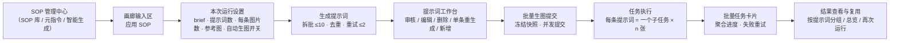
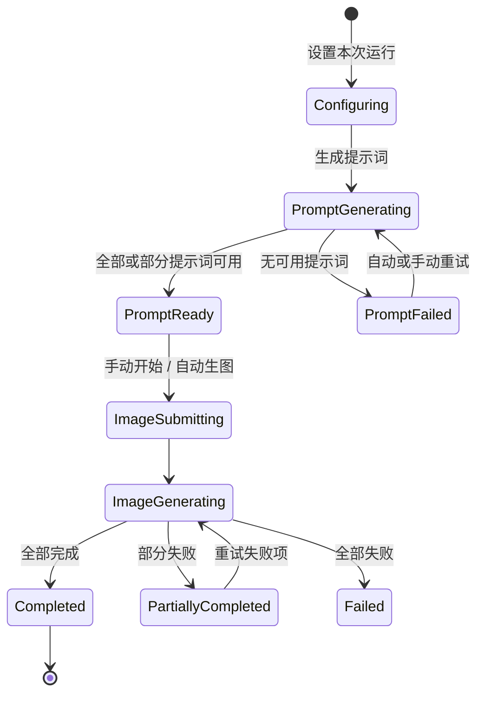

# SOP 生提示词 → 生图：完整规则与流程（SOP 标准作业程序）

> 本文档把「选择 SOP → 生成提示词 → 审核提示词 → 批量生图 → 查看与复用结果」的完整链路固化为可执行、可检查、可回归的作业标准。
> 所有规则以当前实现为准（`src/features/strategy/sopPromptBatch.ts`、`src/features/strategy/adapters/storeSopGeneration.ts`、
> `src/features/strategy/adapters/GallerySopBatchModal.tsx`、`src/store.ts`、`src/lib/sopBatchTaskGrouping.ts`），
> 涉及的产品决策同时参照 `docs/sop-image-generation-interaction-redesign.md`。

---

## 1. 文档定位与术语

| 术语 | 含义 |
| --- | --- |
| SOP | 标准作业程序（Standard Operating Procedure）：结构化 Markdown 系统指令，可直接交给 AI 执行 |
| 本次生成要求（brief） | 只影响当前批次的补充输入；不回写 SOP |
| 提示词 | AI 依据 SOP 生成的、可直接用于图片生成模型的文本 |
| 每条图片数（n） | 一条提示词在一个生图子任务中申请的图片数量 |
| 共同参考图 | 当前输入区全部参考图组成一组，提示词生成与最终生图都使用同一组图 |
| 批次快照（Snapshot） | 开始生图时冻结的不可变数据快照 |
| 批量任务卡片 | 同一批次（同一 `batchId`）所有子任务在任务列表中的聚合展示单元 |
| 文本模型 | OpenAI 兼容的 Agent 文本模型，负责生成提示词 |
| 图片模型 | 当前 API Profile 对应的图片生成 Provider |

**一句话定义本 SOP 的目标**：让「N 条提示词 × 每条 n 张图片」的批量产出在**数量上严格达标、内容上遵循 SOP、执行上可重试可恢复、结果上可追溯可复用**。

---

## 2. 端到端总览

### 2.1 主流程

### 2.2 运行状态机

---

## 3. 前置条件（不满足则阻止进入流程）

| # | 前置条件 | 不满足时的行为 |
| --- | --- | --- |
| 1 | 已选择一个 SOP，且其正文（`content`）非空 | 在输入区相关控件附近显示错误「选择一个 SOP 后开始批量生成」，不等到提交后才报错 |
| 2 | 已配置 OpenAI 兼容的 Agent 文本模型（`validateApiProfile` 通过且 `provider === 'openai'`） | 提示「SOP 提示词生成需要管理员配置 OpenAI 兼容的 Agent 文本模型」 |
| 3 | 已配置图片 API Profile 且校验通过 | 提交时提示完善请求 API 配置并打开设置 |
| 4 | 参考图数量 ≤ 当前图片 Provider 限制 | 提交前阻止，显示「当前模型最多支持 N 张参考图」；用户必须主动移除图片或切换模型，系统不得静默丢弃参考图 |
| 5 | 本次生成要求（brief）为空时 | 不报错，按「将完全按 SOP 执行」处理 |

> 规则：所有校验**前置**到对应控件附近即时反馈，禁止把可提前发现的错误拖到提交时才暴露。

---

## 4. 阶段一：本次运行设置

输入区从「直接生图」切换为「SOP 运行」语义，包含以下配置项与规则：

| 配置项 | 规则 |
| --- | --- |
| SOP 状态胶囊 | 显示 `SOP · {SOP 名称}`，标识当前处于 SOP 运行模式 |
| 本次生成要求 | 可选；必须**原样**传入提示词生成请求，不回写 SOP |
| 提示词数量 | 范围 **1–50**；SOP 模式不复用普通模式的单一「数量」字段 |
| 每条图片数 | 1 到图片 Provider 支持的 `n` 上限（代码硬上限 `MAX_SOP_IMAGES_PER_PROMPT = 20`）；按当前 API Profile 动态限制 |
| 总量摘要 | 实时显示 `N 条提示词 × 每条 n 张 = 预计 M 张图片`；只作预计展示，不得把「图片数」描述成「任务数」 |
| 高用量提醒 | 总图片数 ≥ `SOP_HIGH_VOLUME_WARNING_THRESHOLD = 20` 时，主按钮上方显示「本次预计生成 N 张图片，可能产生较高费用」，并在提交前再次确认数量 |
| 参考图模式 | 固定为「共同参考」；摘要显示 `共同参考 · N 张` |
| 自动生图开关 | 默认关闭；记住当前工作区上次选择；开启后提示词全部生成完自动提交生图 |
| 主按钮 | 审核模式：`生成 N 条提示词`；自动模式：`生成提示词并自动生图` |

---

## 5. 阶段二：提示词生成（核心规则）

### 5.1 请求构造顺序（`buildSopPromptBatchRequest`）

每条模型请求的 user 文本按以下顺序拼接：

1. **任务声明**：`任务：依据 SOP 生成 {count} 条彼此不同、可直接用于图片生成模型的提示词。`
2. **本轮目标说明**：`本轮总目标提示词数量：{total} 条。当前只生成分配给本参考图的 {count} 条。`（仅多来源时）
3. **当前参考图说明**：`当前参考图：{label}（{i}/{n}）。将图中可见事实作为内容依据，并用 SOP 规定的视觉规则组织提示词。`（仅图片来源）
4. **执行契约**（5 条，固定）：
   - 先在内部理解 SOP 的目标、必要约束、建议项、示例和可变部分，再生成；不要输出拆解过程。
   - 补充要求用于补全或调整 SOP 未锁定的内容；只有 SOP 明确标为必须、固定或禁止的规则才视为硬约束。
   - 提示词的语言、详略、结构和画面要素以 SOP 为准；不强行补写 SOP 不需要的字段，不擅自添加模型专用参数。
   - 批次内应在 SOP 允许的维度形成有意义的差异；若 SOP 本身要求固定或相近的结果，优先遵循 SOP。
   - SOP 内若自带 JSON、编号或其他输出示例，只提取其中对提示词内容的要求；最终仍使用本请求末尾规定的 JSON 传输封装。
5. **本批补充要求**：以 `<BRIEF>...</BRIEF>` 包裹（为空时写「本批补充要求：无」）。
6. **已有提示词样本**：以 `<EXISTING_PROMPTS>...</EXISTING_PROMPTS>` 包裹 JSON 数组，要求「不得与已有结果重复或仅做同义改写」。样本数量超过 12 条时截取**前 3 条 + 后 9 条**。
7. **SOP 全文**：以 `<SOP>` 包裹 `名称 / 用途说明 / content`。
8. **自检要求**：`输出前逐条自检：SOP 明确硬约束无遗漏、禁止项未违反、事实未臆造、每条都能脱离上下文独立使用。`
9. **输出封装**：`只返回合法 JSON：{"prompts":["完整提示词 1",...,"共严格 {count} 条"]}`；禁止 Markdown 代码围栏、解释、标题和列表编号；禁止「同上」「保持一致」等省略表达。

### 5.2 系统指令（`SOP_PROMPT_GENERATOR_INSTRUCTION`）

以 system 角色注入，优先级从高到低：

1. **当前请求规定的数量与 JSON 传输封装最高优先**，SOP 自带的示例输出格式不得改变该封装；
2. SOP 中明确规定的**内容要求、视觉常量和禁止项应当保留**；不要把建议、示例或缺省字段误判为强制项；
3. 用户补充要求与参考图用于**填写 SOP 的变量和未定义项**；冲突时不得覆盖 SOP 的强制项与禁止项；
4. 对仍未定义的部分做**专业且保守的补全**，不虚构品牌、产品、文字、功效或规格事实。

输出要求：内部理解后直接产出，不输出分析过程；每条结果独立、可直接用于图片生成；语言、详略、格式以 SOP 为准，SOP 未规定时默认中文；只输出指定 JSON 封装。

### 5.3 参考图使用

- 当前输入区**全部**参考图组成共同参考组，**全部**传入提示词生成模型（`image_url` / `input_image` 类型）。
- 不静默截断为前三张，不把提示词按参考图平均拆分。
- 参考图数量超 Provider 限制时在提交前阻止（见 §3）。

### 5.4 结构化输出与降级

- 优先使用 `json_schema` 结构化输出：schema 名 `sop_prompt_batch`，`prompts` 为 string 数组，`minItems = maxItems = 本批数量`，`additionalProperties: false`。
- 文本协议支持 `chat/completions`（`response_format`）与 `responses`（`text.format`）两种，`max_tokens` 12000。
- **降级规则**：结构化输出请求返回 400/422 时，自动关闭结构化输出、以普通模式重发一次（标记「当前模型已切换为兼容生成模式」），不直接失败。

### 5.5 拆批与进度

- 单次模型请求最多 **10 条**（`MAX_SOP_PROMPTS_PER_MODEL_REQUEST = 10`）。
- 总批次数 = `ceil(提示词总数 / 10)`；每批数量 = `min(10, 剩余缺口)`。
- 进度必须**真实可计算**：显示 `已生成 6/20`；每批完成后通过 `onBatch` 累加已生成数量。只有单批模型请求内部无法获得细粒度进度时才允许该批显示不确定进度，但总批次数与已完成数量始终可见。

### 5.6 响应解析容错（`parseSopPromptBatchResponse`）

解析优先级：

1. **JSON 优先**：依次尝试 原始文本 → 剥离代码围栏 → 首个 `{` 到末个 `}` 截取 → 首个 `[` 到末个 `]` 截取；对候选做键名补引号、去尾逗号修复后 `JSON.parse`；
2. **结构化取值**：优先识别 `prompts / promptList / promptBatch / generatedPrompts / readyToUsePrompts / items` 等列表键；兼容 `data/result/results/output/outputs/response` 包裹层与 `prompt/text/content` 值键；兼容 `prompt1/提示词1/1` 编号键；深度上限 4 层；
3. **文本列表回退**：优先解析 `<prompt>...</prompt>` XML 标签；否则按 `- 列表符 / 1. 编号 / 提示词N：` 标签逐行切分（跨行续接）；
4. **单条回退**：当预期数量为 1 且上述均失败时，剥离代码围栏与 `prompt：` 前缀，若剩余文本不以 `{`/`[` 开头则视为单条提示词；
5. 全部失败 → 报错「模型未返回可用提示词，请重试」。

### 5.7 归一化与去重（`normalizeSopPromptCandidates`）

- 先剥离列表序号标签（`1. / 1、/ 提示词1：/ 第1条：` 等）；
- 去重键 = 文本经 `NFKC` 规范化 → 小写 → 删除所有空白与标点符号；
- 与**已有提示词样本**（含本轮已生成结果）全局去重：重复、空文本、仅同义改写一律丢弃；
- 去重后按 `limit` 截断，先到先得、保持顺序。

### 5.8 数量严格校验与自动重试

| 规则 | 值 |
| --- | --- |
| 单批最大请求条数 | 10 |
| 单批自动重试次数上限 | **2 次**（`SOP_PROMPT_BATCH_MAX_ATTEMPTS = 2`） |
| 单批解析宽松度 | 单批允许返回少于请求数（`exact: false`），缺口由后续批次继续补足 |
| 总量校验 | 循环直到 `已生成数 == 目标数`；最终数量不足时报错：`模型应返回 N 条提示词，实际返回 M 条，请重试` |
| 批次彻底失败 | 单批连续 2 次无可用结果 → 报错 `提示词批次生成失败，已自动尝试 2 次：{原因}` |
| 取消 | 支持 `AbortSignal`；开始新一轮生成时中止上一轮在途请求（AbortError 不视为失败）。关闭工作台**不**中止任务，生成继续在后台运行 |

**缺口处理**：部分批次失败时保留已生成内容，不整体重来；错误项提供「重试缺口」；完全失败时提供「重新生成」，且不清空本次设置。

### 5.9 单条重新生成

- 只请求 **1 条**，并把其余提示词作为去重上下文传入（防止重复）。
- 只替换当前条目，不影响其他提示词。
- 目标条目已被手动编辑过时，重新生成前**提示会覆盖当前内容**。

---

## 6. 阶段三：提示词审核工作台

| 能力 | 规则 |
| --- | --- |
| 来源标识 | 每条提示词标注 `AI 生成` 或 `手动添加` |
| 参与生图 | **不提供勾选**；所有非空、未删除提示词默认参与生图 |
| 编辑 | 可编辑文本；编辑后标记 `已编辑` 状态 |
| 删除 | 从本次草稿中移除，**不删除** SOP 资产；删除后不再参与生图 |
| 手动新增 | 允许手动添加提示词（来源 `manual`） |
| 自动保存 | 草稿修改后**自动保存**（不再提供「保存列表」按钮）；自动保存失败时显示持久化错误与「重试保存」，不得用成功状态掩盖失败 |
| 顶部摘要 | SOP 名称、本次要求摘要、共同参考图缩略图、`提示词数 × 每条图片数 = 总图片数`、当前阶段与整体进度、自动生图状态 |
| 后台运行 | 关闭工作台不中断已开始的提示词生成；输入区显示动态状态入口（`生成提示词 6/20` → `提示词待确认 20` …） |

---

## 7. 阶段四：批量生图提交

### 7.1 提交前校验

1. 至少存在一条可用提示词，否则阻止并提示「请先生成或手动新增至少一条提示词」。
2. 参考图数量未超 Provider 限制（见 §3）。
3. 提交期间禁用重复提交。

### 7.2 快照冻结（不可变）

开始生图前创建 `SopBatchSnapshot` 并写入 IndexedDB：

- 内容：SOP 快照（`id/name/description/content`）、brief、参考图 ID 与顺序、提示词数组（含 `id/index/text/origin/edited`）、`params`、`apiProfileId`、`outputPath`。
- 提交成功后把**真实任务 ID 列表**回写到快照，状态置为 `submitted`。
- 快照创建后**不修改**；后续 SOP 被编辑或删除时，历史批次仍展示快照中的名称与正文。
- 「再次运行」从快照复制出新草稿/新快照（新 `batchId`），不修改原快照。

### 7.3 任务展开模型（关键）

**「执行任务不合并，展示任务合并」**：

- 一条提示词 = 一个真实 `TaskRecord` 子任务；`params.n = 每条图片数`，一个子任务可输出多张图片。
- 所有子任务共享同一个 `batchId`（格式 `sop-batch-{时间戳36进制}`），并携带 `sopBatch` 元数据：
  `{ batchId, snapshotId, sopId, sopName, promptId, promptIndex(从1计), promptCount, imagesPerPrompt }`。
- 子任务携带该提示词对应的参考图（共同参考模式下为共同参考组）。
- 复用现有并发、多图片槽位、失败补偿、恢复、API Profile 与任务持久化能力；**不把 `10 × 2` 扩成 20 个重复提示词任务**。

### 7.4 并发提交与结果处理

- 通过 `Promise.allSettled` 并发提交全部子任务，避免一个失败阻塞整批。
- 提交前状态文案：`正在提交 {N} 条提示词，预计生成 {M} 张图片`。
- 结果处理：
  - 全部成功 → `已并发提交 N 个 SOP 生图任务`，成功 toast；
  - 部分失败 → `部分提交完成：成功 X 个，失败 Y 个`；失败项未创建任务卡，提示检查 API 配置后重新提交；
  - 全部失败 → 状态 error，提示检查图片 API 配置或输出参数后重试。
- **自动生图**：提示词全部生成后自动执行同一提交逻辑；自动模式下出现提示词缺口时**停止自动生图**，等待用户处理，禁止用不完整列表静默提交。

---

## 8. 阶段五：生图任务执行

### 8.1 单任务提交校验（`submitTaskWithData`）

1. API Profile 校验通过（失败则打开设置提示完善配置）；
2. 提示词非空（空则 toast「请输入提示词」）；
3. 参考/遮罩图持久化到 IndexedDB；
4. `normalizeParamsForSettings` 按 Profile 规范化参数（含输入图存在性判断）；
5. 创建 `TaskRecord`（`status: 'running'`）→ 写入 IndexedDB → 触发 `executeTask`。

### 8.2 提示词后处理（提交给图片模型前）

| 处理 | 规则 |
| --- | --- |
| 广告负向规则 | 在提示词后追加 `【信息流广告负向约束：禁止生成以下元素】\n{规则内容}`；规则取当前设置的 `adNegativeRuleId`，缺省回退 `general-strict` |
| 参考图引用 | 提示词中的 `<ref id="..." />` 标签映射为实际的参考图输入，按顺序追加 |
| Codex CLI 兼容模式 | 检测到接口返回的提示词被改写时提示开启；开启后：禁用在此处无效的质量参数、Images API 多图改用并发请求、提示词开头加入简短的不改写要求 |
| 输出参数 | 尺寸、质量、输出格式、压缩、审核、`partial_images`（流式）等按 Profile 与任务参数生效 |

### 8.3 多图槽位与失败恢复

- 一个子任务输出多张图片，按图片槽位独立追踪状态（`queued/running/completed/failed`）。
- 不新增隐藏的整批自动重试；保留成功图片和成功子任务。
- 「重试失败项」只作用于**明确失败或缺失的图片槽位**。
- Provider 响应状态不确定时，先使用现有恢复/查询能力，不立即重复扣费请求。
- 用户手动重试前显示失败数量和预计重新请求的图片数。
- 任务级取消：停止任务时中止在途 API 请求、退避等待与恢复轮询。

### 8.4 Agent 模式生图（补充链路）

Agent（多轮对话）生图遵循独立规则：

- **单图**：调用内置 `image_generation` 工具（或混合模式下的 `generate_image` 函数）；
- **多图**：2 张及以上就绪图片**必须**合并为一次 `generate_image_batch` 调用（`requested_count` 必须等于 `images.length`；公共视觉要求放 `shared_prompt`，单项差异放各 item prompt；`finalize_after_batch` 仅在该批完整完成请求时置 true）；
- **渐进式批次**：需要一致风格/角色/布局时，先出 1 张基图，再通过 `continue_generation` 让后续图片引用基图（`<ref id="..." />`）；
- 工具轮次受 `agentMaxToolRounds` 上限约束；任务完成即停止调用工具；
- 广告负向约束注入 Agent 系统指令，作用于每个生图/批次提示词。

---

## 9. 阶段六：进度与聚合展示

### 9.1 批量任务卡片

同一 `batchId` 的所有子任务在任务列表中聚合为**一张卡片**：

- 内容：SOP 名称、「批量任务」标识、本次要求一行摘要、`10 条提示词 · 20 张图片`、已完成图片数/总图片数、生成中/失败提示词数、最多 4 张紧凑拼贴（更多显示 `+N`）、后台运行时间、`查看结果`、`重试失败项`（仅有失败时）。
- **状态计算必须基于图片槽位与子任务状态实时汇总**，不能只数子任务数量，也不能缓存为一次性状态。

### 9.2 批次状态判定

| 条件 | 批次状态 |
| --- | --- |
| 存在排队或运行中的子任务 | 生成中 |
| 全部成功 | 已完成 |
| 全部失败或取消 | 失败 |
| 同时存在成功与失败且无运行中 | 部分完成 |

搜索与状态筛选基于子任务集合计算：任一子任务命中即保留该批次卡片，并展示命中数量。

### 9.3 输入区后台状态入口（关闭工作台后）

| 阶段 | 文案 |
| --- | --- |
| 提示词生成 | `生成提示词 6/20` |
| 等待审核 | `提示词待确认 20` |
| 提交生图 | `正在提交 8/20` |
| 生图进行中 | `正在生图 12/20` |
| 部分失败 | `部分失败 3 项` |
| 完成 | `已完成 20 张` |

点击状态入口回到当前工作台或批次详情；完成/失败后使用现有浏览器/桌面通知；每个工作区标签显示自己的 SOP 草稿与运行状态。

---

## 10. 阶段七：结果查看、失败重试与复用

### 10.1 结果视图（记住上次选择）

- **按提示词分组（默认）**：每组展示提示词序号与状态、可展开的完整提示词、该提示词的全部图片变体；单图支持收藏/下载/继续编辑；支持整组重新生成（创建新子任务/新一轮，**不覆盖旧图**，旧结果继续属于原批次快照）。
- **全部图片总览**：100–140px 自适应缩略图，仅叠加提示词序号、变体序号与失败状态，不展示长提示词；悬停指针预览、点击打开单图详情、键盘可聚焦打开。

### 10.2 删除批次

- 删除前二次确认，说明将删除：多少个子任务、多少张结果图片、批次快照是否一并删除。
- 不可通过单击图标直接删除；批量删除、拖拽框选按批次作为一个视觉单元，操作时映射为其全部子任务 ID。

### 10.3 复用能力

| 能力 | 规则 |
| --- | --- |
| 重试失败项 | 只针对失败或缺失图片槽位；保留成功图片 |
| 再次运行 | 从快照复制出新的草稿/新快照（新 `batchId`），不修改原快照 |
| 复用配置 | 恢复提示词、参数、输入图、输出路径与 API Profile（支持临时复用任务所用 Profile，缺失时确认后回退当前配置） |
| 封面选择 | 从该 SOP 历史生图输出中选择封面；移除封面可清空 |
| 素材库归档 | 生成结果进入素材库，按来源（`sop`）区分 |
| 历史提示词查看 | 在 SOP 库中查看该 SOP 关联的全部批次快照与未删除提示词，支持复制 |

---

## 11. 全链路规则速查表

| # | 规则 | 值 / 行为 |
| --- | --- | --- |
| 1 | 提示词数量范围 | 1–50 |
| 2 | 每条图片数上限 | Provider `n` 上限，代码硬上限 20 |
| 3 | 高用量提醒阈值 | 预计总图片数 ≥ 20 |
| 4 | 单次模型请求最大提示词数 | 10 |
| 5 | 提示词生成自动重试 | 每批最多 2 次 |
| 6 | 总量校验 | 生成总数必须等于目标数，否则报错重试 |
| 7 | 去重 | NFKC + 小写 + 去空白标点后比对，与已有结果全局去重 |
| 8 | 解析容错 | JSON → 结构化取值 → 文本列表 → 单条回退 |
| 9 | 结构化输出降级 | 400/422 时关闭结构化输出重发一次 |
| 10 | 参考图 | 全部作为共同参考，提示词生成与生图子任务都用同一组；超限阻止提交 |
| 11 | 任务模型 | 1 条提示词 = 1 个 TaskRecord，`params.n` 张图片，共享 batchId |
| 12 | 快照 | 开始生图时冻结，不可变，提交成功后回写 taskIds |
| 13 | 提交并发 | Promise.allSettled，单任务失败不阻塞整批 |
| 14 | 自动生图 | 全部提示词就绪才自动提交；有缺口停止等待 |
| 15 | 广告负向规则 | 追加到提交给图片模型的每个提示词 |
| 16 | 批次状态 | 基于图片槽位实时计算：生成中/已完成/失败/部分完成 |
| 17 | 失败重试 | 手动、按失败图片槽位；Provider 状态不确定先恢复查询 |
| 18 | 删除批次 | 二次确认，明示子任务/图片/快照影响 |
| 19 | 再次运行 | 复制快照、新 batchId、不修改原快照 |
| 20 | 后台运行 | 关闭工作台不中断；输入区显示动态状态入口 |

---

## 12. 边界与禁止事项

1. **禁止静默截断参考图**；超限必须阻止并引导移除或切换模型。
2. **禁止用不完整提示词列表静默自动生图**；缺口必须先处理。
3. **禁止把「图片数」表述成「任务数」**；总量只作预计展示。
4. **禁止修改已冻结的批次快照**；历史批次展示快照内容，不受 SOP 后续编辑/删除影响。
5. **禁止隐藏整批自动重试生图**（避免重复扣费）；只做手动失败项重试与不确定状态恢复。
6. **禁止在提示词生成阶段虚构**品牌、产品、文字、功效或规格事实；只做专业且保守的补全。
7. **禁止批量卡片充当持久化任务 ID**；一切操作必须映射回真实子任务 ID。
8. **禁止删除 SOP 资产**：工作台删除/编辑仅作用于本次草稿或快照，不改变 SOP 库内容。
9. 收藏视图按单张图片管理，不强制批次聚合，避免「只收藏批次中一张图」产生歧义。
10. 单图操作（复用参数、编辑输出、收藏）放在批次详情的具体图片项，不对不同提示词做不明确的批量操作。

---

## 13. 关联文档

| 文档 | 用途 |
| --- | --- |
| `docs/sop-management-center-features.md` | SOP 库 / 分组 / 元指令 / 智能生成（本 SOP 的上游资产） |
| `docs/sop-image-generation-interaction-redesign.md` | 本次交互改造的产品决策与验收标准 |
| `docs/gallery-sop-batch-task-card-implementation.md` | 批量任务卡片实现细节 |
| `docs/agent-hybrid-batch-image-failure-fix.md` | Agent 批量生图失败修复 |
| `src/features/strategy/sopPromptBatch.ts` | 提示词生成纯函数与常量（唯一事实来源） |
| `src/features/strategy/adapters/storeSopGeneration.ts` | 提示词生成 API 适配层 |
| `src/features/strategy/adapters/GallerySopBatchModal.tsx` | 提示词工作台与批量提交 |
| `src/lib/sopBatchTaskGrouping.ts` | 批次聚合与状态计算 |
