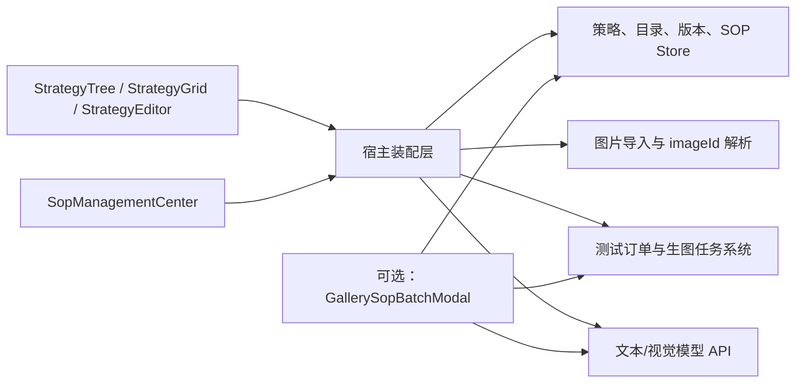
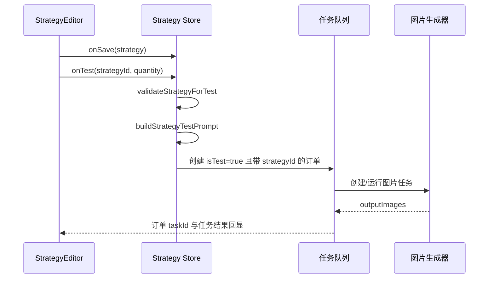

# 策略模块跨项目复刻指南

本文以当前仓库 `src/features/strategy` 的实际实现为准，目标是在另一个项目中复刻“策略工作区 + SOP 库”，并可选接入画廊的 SOP 批量生图流程。

## 1. 适用范围与前置假设

默认目标项目使用 React、TypeScript 和 Tailwind CSS。若目标项目不是这套技术栈：

- `model.ts`、`sopGeneration.ts`、`sopPromptBatch.ts`、`sopLibrary.ts` 可直接移植。
- React 组件和 Tailwind 样式需要按目标 UI 技术栈重写。
- `adapters` 必须根据目标项目的 Store、图片存储、模型 API 和任务系统重写。

建议先确定复刻范围：

| 范围       | 包含内容                                              | 适合场景               |
| ---------- | ----------------------------------------------------- | ---------------------- |
| MVP        | 策略树、策略卡片、策略编辑、SOP 选择、保存            | 只需要管理策略         |
| 完整工作区 | MVP + SOP 管理中心 + 测试任务 + 版本回滚 + 图片结果   | 复刻当前策略页         |
| 完整联动   | 完整工作区 + 画廊选择 SOP + 批量生成提示词 + 批量生图 | 复刻当前仓库的完整链路 |

## 2. 模块能力

当前模块包含以下业务能力：

1. 按“产品 → 素材类型 → 策略”组织策略树。
2. 新建、复制、跨目录移动、重命名和归档策略。
3. 配置文生图或图生图、参考图、生成要求、知识词条和 SOP。
4. 配置可选输出渠道、尺寸、导出预设和分配预设。
5. 保存草稿、提交审核、管理员发布和回滚历史版本。
6. 把策略编译为测试提示词并创建测试任务。
7. 回显测试任务的生成图片，允许覆盖或复用结果提示词。
8. 管理 SOP 分组、SOP 正文和 SOP 元指令。
9. 使用文字或最多 8 张参考图调用模型生成 SOP。
10. 可选：在画廊中使用 SOP 批量生成提示词，再并发创建生图任务。

## 3. 架构和数据流



核心原则是：组件只接收数据和回调；宿主相关逻辑集中在 `adapters`。不要把目标项目的 API Key、数据库实现、Electron API 或全局 Store 直接写进核心组件。

## 4. 当前目录与迁移边界

```text
src/features/strategy/
├─ index.ts
├─ types.ts
├─ contracts.ts
├─ model.ts
├─ sopGeneration.ts
├─ sopPromptBatch.ts
├─ sopLibrary.ts
├─ StrategyTree.tsx
├─ StrategyGrid.tsx
├─ StrategyEditor.tsx
├─ SopManagementCenter.tsx
├─ SopPresetPickerModal.tsx
├─ styles.css
├─ adapters/
│  ├─ RequirementStrategyWorkspace.tsx
│  ├─ StoreStrategyImage.tsx
│  ├─ storeSopGeneration.ts
│  └─ GallerySopBatchModal.tsx
└─ *.test.ts
```

迁移建议：

| 文件                               | 处理方式               | 原因                                                        |
| ---------------------------------- | ---------------------- | ----------------------------------------------------------- |
| `types.ts`、`contracts.ts`         | 原样复制               | 领域模型和最小宿主契约                                      |
| `model.ts`                         | 原样复制               | 默认值、旧数据兼容、校验、提示词编译                        |
| `sopGeneration.ts`                 | 原样复制               | SOP 模型指令、请求构造和响应解析                            |
| `sopPromptBatch.ts`                | 原样复制               | SOP 批量提示词分配、去重和解析                              |
| `sopLibrary.ts`                    | 原样复制               | SOP 初始数据与 ID 生成                                      |
| 三个 `Strategy*.tsx`               | 优先原样复制           | 核心工作区 UI                                               |
| `SopManagementCenter.tsx`          | 完整工作区复制         | SOP 管理与智能生成 UI                                       |
| `styles.css`                       | 原样复制               | 三栏布局、响应式和动效                                      |
| `SopPresetPickerModal.tsx`         | 复制并替换关闭钩子     | 依赖宿主的 `useCloseOnEscape`                               |
| `RequirementStrategyWorkspace.tsx` | 重写                   | 当前实现绑定需求原型 Store、任务 Store、IndexedDB、Electron |
| `StoreStrategyImage.tsx`           | 重写                   | 当前实现绑定全局图片缓存                                    |
| `storeSopGeneration.ts`            | 重写请求部分           | 当前实现绑定 API Profile 和代理配置                         |
| `GallerySopBatchModal.tsx`         | 仅完整联动时移植并重写 | 强绑定画廊输入、任务提交和工作区标签                        |

注意：`index.ts` 当前没有导出 `SopManagementCenter` 和 `SopPresetPickerModal`，装配层直接从文件导入它们。目标项目可保持现状，也可补充公共导出。

## 5. 依赖

核心 UI 的直接依赖：

```bash
npm install react react-dom lucide-react
```

当前仓库版本基线：React 19、TypeScript 5.8、Tailwind CSS 3.4、lucide-react 1.x。Zustand 只是当前宿主 Store 的实现，不是核心组件的强依赖。

Tailwind 必须扫描迁入目录：

```js
export default {
  content: ['./src/**/*.{js,ts,jsx,tsx}'],
}
```

必须加载 `styles.css`。当前适配器已经 `import '../styles.css'`；若改用 `index.ts` 入口，则入口也会加载该样式。二者保留一个即可。

布局要求：

- 桌面端是三栏：策略树、策略卡片区、策略编辑器。
- 当前断点在 900px，低于该宽度转为纵向布局。
- 工作区容器当前使用 `h-[calc(100vh-64px)]`，目标项目 Header 高度不同则必须调整。

## 6. 核心数据模型

### 6.1 `StrategyAsset`

`StrategyAsset` 是策略持久化主对象：

```ts
interface StrategyAsset {
  id: string
  name: string
  productId: string
  materialTypeId: string
  description: string
  coverImageId?: string
  generationMode: 'text-to-image' | 'image-to-image' | null
  workflow: StrategyWorkflow
  outputs: StrategyOutputs
  quantity: number
  status: 'draft' | 'review' | 'published'
  version: number
  createdBy: string
  createdAt: number
  updatedAt: number
  archived?: boolean
  resultPromptOverrides?: Record<string, string>
}
```

关键约束：

- `image-to-image` 才使用 `workflow.reference`。
- 当前测试校验的硬条件是存在一份已解析、非 `none` 且正文非空的 SOP。
- 启用渠道或尺寸时，对应选择不能为空。
- 启用导出时必须先启用渠道并选择导出预设。
- 启用分配时必须先启用渠道或尺寸，并选择分配预设。
- 读取任何历史或外部数据前都要执行 `normalizeStrategyAsset`。

### 6.2 SOP 数据

| 类型                 | 用途                                                                |
| -------------------- | ------------------------------------------------------------------- |
| `SopGroup`           | SOP 分组                                                            |
| `SopLibraryItem`     | 可被策略和画廊选用的 SOP 正文                                       |
| `SopMetaInstruction` | 用来指导模型“如何生成 SOP”的元指令                                  |
| `StrategyPreset`     | 当前只继续承载 `export` 和 `allocation`；旧 `sop` 预设会迁入 SOP 库 |

`seedSopLibrary` 会把未归档的旧 `StrategyPreset(type='sop')` 转成 `source: 'legacy-preset'` 的 SOP 项。

### 6.3 宿主最小只读契约

`contracts.ts` 定义 UI 所需的最小形状：

| 契约                       | 必要信息                            |
| -------------------------- | ----------------------------------- |
| `StrategyCatalog`          | 产品、素材类型、渠道                |
| `StrategyKnowledgeBatch`   | 知识素材批次、目录和状态            |
| `StrategyKnowledgeInsight` | 知识结论标题、分类和批次关联        |
| `StrategyTestOrder`        | 测试订单、测试单元、任务 ID、提示词 |
| `StrategyTask`             | 任务提示词和输出图片 ID             |
| `StrategyRole`             | `optimizer`、`strategist`、`admin`  |

目标项目不需要复制当前需求原型的完整类型，只需映射成这些形状。

## 7. 核心组件接口

### 7.1 `StrategyTree`

输入：`catalog`、`strategies`、`selection`。

宿主必须实现：

```ts
onSelect(selection)
onRenameProduct(id, name)
onRenameType(id, name)
onRenameStrategy(id, name)
onCreateStrategy(productId, materialTypeId)
onMoveStrategy(strategyId, productId, materialTypeId)
```

### 7.2 `StrategyGrid`

输入：目录、当前可见策略、测试订单、任务、图片组件、当前选择。

宿主必须实现：新建、重命名、复制、粘贴、归档、设置封面、本地选封面、保存结果提示词覆盖、复用提示词。

图片不是 URL，而是 `imageId`。目标项目必须实现：

```tsx
function ProjectStrategyImage({ imageId, alt, className }: StrategyImageProps) {
  const url = useProjectImageUrl(imageId)
  return url ? (
    
  ) : (
    <div className={className} aria-label={`${alt}暂无图片`} />
  )
}
```

URL 如果由 `URL.createObjectURL` 创建，组件卸载或图片变化时必须调用 `URL.revokeObjectURL`。

### 7.3 `StrategyEditor`

输入包括当前策略、目录、导出/分配预设、SOP 库、版本、知识库、测试订单和当前角色。

宿主必须实现：

```ts
onSave(strategy)
onTest(strategyId, quantity) // 同步返回 { error?: string }
onPickLocalReference() // Promise<string[]>，返回 imageId
onPickKnowledgeMaterial(batchId) // Promise<string[]>，返回 imageId
onRollback(version)
```

注意：当前版本的 SOP 智能生成已经移到 `SopManagementCenter`，不再由 `StrategyEditor` 调用模型。编辑器只选择或移除 SOP。

### 7.4 `SopManagementCenter`

输入为 SOP 分组、SOP 项、元指令和当前用户 ID。宿主需要为三类对象分别提供保存、复制和删除回调，并实现 `onGenerateSop: GenerateSop`。

```ts
type GenerateSop = (
  description: string,
  context: { product?: string; materialType?: string; generationMode?: string },
  referenceImages?: Array<{ name: string; dataUrl: string }>,
  kind?: 'general' | 'image-prompt',
  metaInstruction?: string,
) => Promise<{ name: string; description: string; sop: string }>
```

组件内置限制：最多 8 张参考图，单图最大 10 MiB；`image-prompt` 类型必须至少上传一张图。

## 8. 推荐的宿主数据端口

当前组件采用分散 props。目标项目可在装配层内部定义一个统一端口，避免 UI 直接依赖全局 Store：

```ts
interface StrategyHostPort {
  currentUserId: string
  role: StrategyRole
  catalog: StrategyCatalog
  strategies: StrategyAsset[]
  presets: StrategyPreset[]
  sopGroups: SopGroup[]
  sopItems: SopLibraryItem[]
  sopMetaInstructions: SopMetaInstruction[]
  versionsByStrategyId: Record<string, StrategyAsset[]>
  knowledgeBatches: StrategyKnowledgeBatch[]
  knowledgeInsights: StrategyKnowledgeInsight[]
  orders: StrategyTestOrder[]
  tasks: StrategyTask[]

  saveStrategy(value: StrategyAsset): void
  createStrategy(productId: string, materialTypeId: string): string | null
  duplicateStrategy(strategyId: string, productId?: string, materialTypeId?: string): string | null
  moveStrategy(strategyId: string, productId: string, materialTypeId: string): void
  archiveStrategy(strategyId: string): void
  rollbackStrategy(strategyId: string, version: number): void
  createStrategyTest(strategyId: string, quantity: number): { error?: string }

  importLocalImages(multiple: boolean): Promise<string[]>
  importKnowledgeImages(batchId: string): Promise<string[]>
  generateSop: GenerateSop
}
```

这只是推荐的适配层结构，不是当前核心模块导出的强制接口。

## 9. 三条关键运行链路

### 9.1 策略编辑与发布

1. 用 `normalizeStrategyAsset` 生成编辑草稿。
2. 修改已发布策略时，编辑器会把状态降回 `draft`。
3. 保存只更新当前记录。
4. 提交审核把状态设为 `review`。
5. 管理员发布时设为 `published` 并把 `version + 1`。
6. Store 在“新发布版本”产生时，把旧记录放入版本历史；当前实现每个策略最多保留 20 条。
7. 回滚不是简单覆盖：回滚目标成为新的发布版本，版本号继续递增，并把回滚前状态放回历史。

### 9.2 一键测试



目标项目创建测试订单时至少保留：`isTest`、`strategyId`、`units[].taskId`、`units[].prompt`。否则 `StrategyGrid` 无法把生成结果关联回策略。

当前测试权限：`strategist` 和 `admin` 可以创建测试；`optimizer` 不可以。发布、版本历史和回滚入口仅对 `admin` 显示。

### 9.3 SOP 智能生成

1. `validateSopGenerationInput` 校验文字和参考图。
2. `getSopGeneratorInstruction` 选择通用、图片提示词或自定义元指令。
3. `buildSopRequestContent` 生成模型输入，图片使用 Data URL。
4. 宿主调用支持多模态输入的文本/视觉模型。
5. `extractResponseText` 提取 Responses 风格返回文本。
6. `parseGeneratedSop` 校验 `{ name, description, sop }` JSON。
7. 管理中心把结果保存为 `SopLibraryItem`。

模型适配器的最小实现：

```ts
const generateSop: GenerateSop = async (brief, context, images = [], kind = 'general', customInstruction) => {
  validateSopGenerationInput(brief, images, kind)
  const response = await projectModelClient.generate({
    instruction: getSopGeneratorInstruction(kind, customInstruction),
    content: buildSopRequestContent(brief, context, images, kind),
  })
  return parseGeneratedSop(response.text)
}
```

如果模型 API 不是 OpenAI Responses 格式，保留请求构造和 `parseGeneratedSop`，只替换请求与文本提取部分。

## 10. 状态管理和持久化

完整工作区至少持久化：

```ts
strategyAssets: StrategyAsset[]
strategyPresets: StrategyPreset[]
sopGroups: SopGroup[]
sopLibrary: SopLibraryItem[]
sopMetaInstructions: SopMetaInstruction[]
strategyAssetVersions: Record<string, StrategyAsset[]>
```

首次初始化：

```ts
const presets = seedStrategyPresets()

const initialState = {
  strategyAssets: [],
  strategyPresets: presets,
  sopGroups: seedSopGroups(),
  sopLibrary: seedSopLibrary(presets),
  sopMetaInstructions: seedSopMetaInstructions(),
  strategyAssetVersions: {},
}
```

迁移旧数据：

```ts
const migrated = {
  ...persisted,
  strategyAssets: (persisted.strategyAssets ?? []).map(normalizeStrategyAsset),
  strategyAssetVersions: Object.fromEntries(
    Object.entries(persisted.strategyAssetVersions ?? {}).map(([id, versions]) => [
      id,
      versions.map(normalizeStrategyAsset),
    ]),
  ),
  sopGroups: persisted.sopGroups?.length ? persisted.sopGroups : seedSopGroups(),
  sopLibrary: persisted.sopLibrary?.length
    ? persisted.sopLibrary
    : seedSopLibrary(persisted.strategyPresets ?? presets),
  sopMetaInstructions: persisted.sopMetaInstructions?.length
    ? persisted.sopMetaInstructions
    : seedSopMetaInstructions(),
}
```

数据迁移时保留原 ID、目录关联 ID、创建者、时间戳和版本号。图片必须单独迁移并建立旧 `imageId → 新 imageId` 映射；只迁移策略 JSON 不会迁移图片本体。

删除 SOP 分组时，当前实现不会删除组内 SOP，而是把它们改为未分组。目标项目应保持该行为，避免误删资产。

## 11. 应用入口接入

### 11.1 注册应用模式

```ts
export type AppMode = 'gallery' | 'strategy' | 'ordering' | 'agent' | 'postprocess'
```

应用状态恢复白名单也必须允许 `strategy`，否则刷新后会回到默认工作区。

### 11.2 懒加载工作区

```tsx
const StrategyWorkspace = React.lazy(() => import('./features/strategy/adapters/ProjectStrategyWorkspace'))

{
  appMode === 'strategy' && (
    <React.Suspense fallback={null}>
      <StrategyWorkspace />
    </React.Suspense>
  )
}
```

### 11.3 收口其他工作区 UI

进入策略模式后必须隐藏画廊专属输入栏、侧栏、选区和浮层。例如：

```tsx
{
  ;(appMode === 'gallery' || appMode === 'agent') && <InputBar />
}
```

桌面和移动导航都要增加“策略”入口。

## 12. 可选：画廊 SOP 批量生图联动

如果只复刻策略工作区，可以跳过本节。

联动文件：

- `SopPresetPickerModal.tsx`：在画廊选择 SOP。
- `sopPromptBatch.ts`：数量分配、参考图选择、响应解析和去重。
- `adapters/GallerySopBatchModal.tsx`：提示词生成、编辑、保存、补缺和任务提交。
- `adapters/storeSopGeneration.ts` 中的 `generatePromptsFromSopStore`：模型请求适配。

核心规则：

- 单次操作最多 50 条提示词；内部按每次最多 10 条拆分模型请求，格式失败会自动重试一次。
- 未在补充要求中使用 `@图N` 时，默认最多取前 3 个参考源。
- 使用 `@图1`、`@图2` 可明确选择参考图。
- 总数量按参考源尽量均分，余数从前往后分配。
- 提示词会去空、去重，并校验模型返回数量。
- 每条提示词创建一个 `n: 1` 的生图任务；图生图任务只带该提示词所属参考图。
- 当前草稿按工作区标签存入 `localStorage`：`tangbao.gallery-sop-prompt-run.<tabId>`。
- 提交任务时当前实现附带 `sopBatch: { batchId, sopId, sopName, promptIndex, promptCount }`，便于任务卡分组。

目标项目需要重写四个宿主能力：

```ts
getCurrentInputImages(): Array<{ id: string; dataUrl?: string }>
resolveImageDataUrl(imageId: string): Promise<string | undefined>
generatePromptsFromSop(...): Promise<string[]>
submitImageTask(input): Promise<string | null>
```

`SopPresetPickerModal` 当前依赖 `src/hooks/useCloseOnEscape`。迁移时可以一并复制该钩子，也可以在组件内用 `keydown` 监听替代。

## 13. 分阶段实施步骤

### 阶段 A：可运行的核心工作区

1. 复制核心文件和样式。
2. 安装 React、lucide-react 和 Tailwind 依赖。
3. 建立最小目录、策略和 SOP 初始数据。
4. 实现 `ProjectStrategyWorkspace`，先接通内存状态。
5. 实现 `ProjectStrategyImage`。

验证：三栏能显示；可以新建、选择、编辑、保存和复制策略；刷新要求可留到阶段 B。

### 阶段 B：持久化与业务操作

1. 把策略、版本、SOP、目录接入正式 Store/数据库。
2. 每次读取策略时执行 `normalizeStrategyAsset`。
3. 接入图片导入和图片 ID 解析。
4. 实现角色权限、审核、发布和回滚。

验证：刷新后数据恢复；归档不物理删除；发布和回滚版本正确。

### 阶段 C：测试生成闭环

1. 用 `buildStrategyTestPrompt` 编译提示词。
2. 建立测试订单与任务的关联。
3. 同步任务状态和输出图片。
4. 在 `StrategyGrid` 回显结果并验证提示词覆盖。

验证：一键测试后能看到任务状态、图片和对应提示词。

### 阶段 D：SOP 智能生成

1. 接入 `SopManagementCenter`。
2. 实现 `GenerateSop` 模型适配器。
3. 验证通用 SOP、图片 SOP和自定义元指令。

验证：错误 JSON 会提示失败；合法结果会保存进 SOP 库并可被策略选择。

### 阶段 E：画廊联动（可选）

1. 在画廊输入区加入 SOP 选择和提示词列表入口。
2. 接入批量提示词生成。
3. 接入本地保存、缺口重试和任务批量提交。

验证：文生图、单参考图、多参考图、`@图N`、部分失败重试均可工作。

## 14. 验收清单

### 数据与操作

- [ ] 旧策略和历史版本读取时均经过 `normalizeStrategyAsset`。
- [ ] 新建、保存、复制、移动、归档策略可用。
- [ ] 删除 SOP 分组不会删除组内 SOP。
- [ ] 图片 ID 在封面、参考图和测试结果三个位置均可解析。
- [ ] 刷新后策略、SOP、版本和当前应用模式可恢复。

### 校验与权限

- [ ] 没有可执行 SOP 时不能测试。
- [ ] 输出渠道、尺寸、导出和分配的依赖校验正确。
- [ ] `optimizer` 不能创建策略测试。
- [ ] 只有 `admin` 能发布和回滚。
- [ ] 非管理员只能看到自己的测试订单和结果；管理员可查看全部。

### SOP 生成

- [ ] 无文字且无图片时阻止生成。
- [ ] 图片 SOP 无参考图时阻止生成。
- [ ] 超过 8 张参考图或单图超过 10 MiB 时阻止生成。
- [ ] 模型返回非 JSON 或缺字段时显示明确错误。
- [ ] 生成结果可保存、复制、编辑、删除并被策略选用。

### UI

- [ ] 策略模式不显示画廊输入栏和画廊侧栏。
- [ ] 桌面三栏无横向溢出。
- [ ] 小于 900px 时可纵向浏览全部区域。
- [ ] 浅色、深色和减少动态效果模式可用。

### 自动化验证

```bash
npm test -- src/features/strategy
npm run build
```

至少保留并适配以下测试：

- `model.test.ts`：旧数据规范化、校验和测试提示词。
- `sopGeneration.test.ts`：输入限制、请求内容和响应解析。
- `sopPromptBatch.test.ts`：数量分配、来源选择、去重和数量校验。
- `StrategyEditor.test.ts`：文件选择快照，避免异步读取失效。

## 15. 常见错误

1. **直接复制当前适配器。** 它依赖 `useRequirementPrototype`、全局 `useStore`、IndexedDB 和 `window.electronAPI`，在其他项目中通常无法工作。
2. **只迁移策略 JSON，不迁移图片。** 策略保存的是图片 ID，不是图片数据。
3. **绕过 `normalizeStrategyAsset`。** 旧字段如 `steps`、`promptTemplate`、`sop`、`channelIds` 将无法正确进入新结构。
4. **把 SOP 生成仍接在编辑器。** 当前职责已经迁移到 `SopManagementCenter`。
5. **测试订单缺少 `strategyId` 或 `taskId`。** 结果区将无法归属到策略。
6. **发布时不保存旧版本。** 回滚列表会为空或指向错误状态。
7. **同时从 `index.ts` 和适配器重复导入样式。** 可能造成样式重复注入；选择一个入口即可。
8. **忽略容器高度。** `64px` 是当前 Header 高度，不是模块固定要求。

## 16. 当前仓库参考入口

- 根应用挂载：`src/App.tsx`
- 桌面/移动导航：`src/components/Header.tsx`
- 应用模式和恢复白名单：`src/types.ts`、`src/store.ts`
- 完整工作区装配：`src/features/strategy/adapters/RequirementStrategyWorkspace.tsx`
- 当前策略/SOP 持久化实现：`src/features/requirementPrototype/store.ts`
- 当前测试任务执行器：`src/features/requirementPrototype/QueueRunner.tsx`
- 画廊 SOP 入口：`src/components/InputBar.tsx`

复刻时应优先保留核心数据结构和组件契约，把所有宿主差异收敛到新的 `ProjectStrategyWorkspace`、图片解析器、模型适配器和任务适配器中。
